# Цифровая обработка изображений

© Бибиков С.А., к.т.н., доцент кафедры суперкомпьютеров и общей информатики, Самарский университет

## Лекция 2. Цифровая фотография и ее технические особенности

## Содержание

1. [Системы технического зрения](#21-системы-технического-зрения)
2. [Особенности человеческой зрительной системы и их реализация в системах технического зрения](#22-особенности-человеческой-зрительной-системы-и-их-реализация-в-системах-технического-зрения)
3. [Способы регистрации изображения системами технического зрения](#23-способы-регистрации-изображения-системами-технического-зрения)
4. [Цветные сенсоры](#24-цветные-сенсоры)
5. [Динамический диапазон](#25-динамический-диапазон)
6. [Гамма-преобразование](#26-гамма-преобразование)
7. [Получение изображения в стандартном цветовом пространстве. Простейший информационный тракт](#27-получение-изображения-в-стандартном-цветовом-пространстве-простейший-информационный-тракт)
8. [Гиперспектральные изображения. Синтезирование цвета](#28-гиперспектральные-изображения-синтезирование-цвета)
9. [Цветовые профили устройств](#29-цветовые-профили-устройств)


### 2.1 Системы технического зрения

`Система технического зрения` — это специальное сенсорное устройство, с помощью которого можно обеспечить получение изображений, их последующую обработку и извлечение полезной информации. Далее будем сокращать до `СТЗ`. В принципе под СТЗ в нашем случае будем понимать устройство, способное создавать цифровые изображения реальной сцены (камеры смартфонов и ноутбуков). Но про СТЗ в целом нужно немного рассказать.


<div align="center">
  
  
  Рисунок 1 – Система технического зрения на примере автоматизации склада
</div>

Если грубо разделить функционал, то СТЗ решают следующие задачи:
1. `Регистрация` - преобразование электромагнитного излучения определенного спектра в вид, удобный для последующей обработки и анализа. В этой задаче нас будут интересовать только базовые принципы регистрации.
2. `Предварительная обработка` - преобразование полученной на этапе регистрации информации к форме, позволяющей максимально эффективно решать поставленную перед СТЗ задачу. А вот это полностью наша тема.
3. `Анализ` - аналитическая обработка информации, полученной после предварительной обработки, для решения поставленной задачи. Анализ нас тоже будет интересовать.

СТЗ применяются для решения огромного количества задач:
- всевозможный контроль технологических процессов в различных отраслях промышленности
- контроль и учет перемещений объектов на различных складах
- системы контроля и управления доступом
- системы безопасности
- и т.п.

<div align="center">
  <div align="center">
    a)
    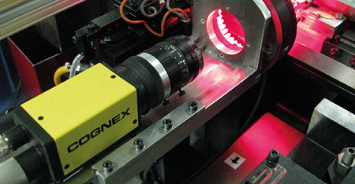
  </div>
  <div align="center">
    б)
    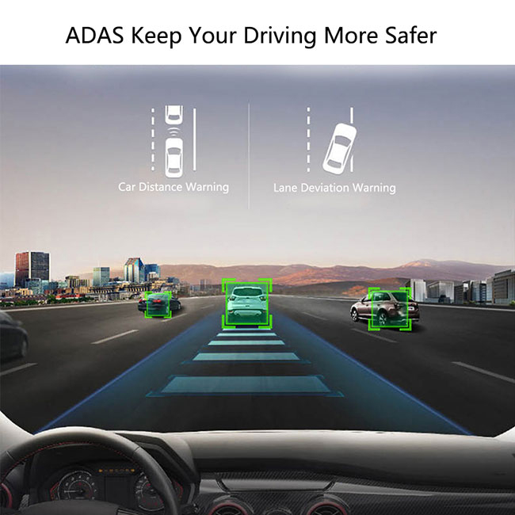
  </div>
  <div align="center">
    в)
    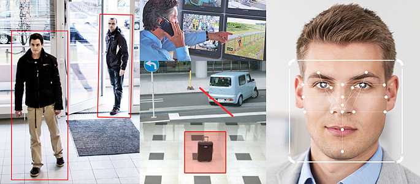
  </div>

  Рисунок 2 – Примеры применения СТЗ:  
  производство (а), системы помощи водителю (б), системы контроля и управления доступом (в)
</div>

---
Пример: система помощи водителю предназначена для распознавания и отслеживания различных объектов в процессе движения транспортного средства для облегчения процесса принятия решений водителем.

<div align="center">
  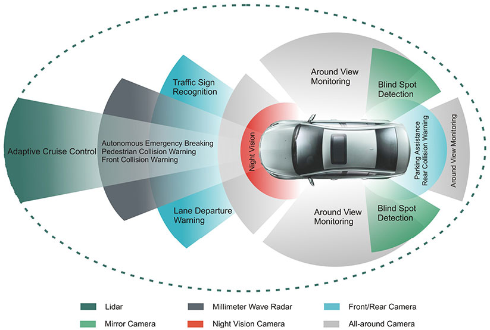
  
  Рисунок 3 – Система помощи водителю (Advanced Driver Assistance System - ADAS)
</div>

В качестве сенсоров в такой системе могут выступать различные устройства:
- `Ультрозвуковые датчики`, определяющие расстояние до окружающих объектов. Сейчас применяются повсеместно для облегчения парковки.
- `Видеокамеры` (в том числе и стерео) применяются для решения различных задач:
  - отслеживание разметки;
  - распознавание дорожных знаков;
  - определение наличия пешеходов на траектории движения;
  - определение наличия транспортных средств вокруг носителя СТЗ.
- `Радары` (хоть и экзотика) предназначены для определения наличия других транспортных средств и препятствий.
- `Лидары` (или "лазерные радары") позволяют строить максимально точную картину окружающей обстановки с высокой точностью и скоростью обновления.

В качестве предварительной обработки могут использоваться различные алгоритмы в зависимости от решаемой задачи и используемого сенсора:
- выделение элементов разметки на дороге;
- обнаружение областей интереса, возможно, содержащих изображения дорожных знаков;
- построение трехмерной карты окружаеющей обстановки по данным радара/лидара;
- оценка расстояния до объекта при использовании стереокамер
- и т.д.

Анализ получаемой после предварительной обработки информации с сенсора также определяется решаемой задачей:
- определение, является ли обнаруженный объект человеком, пересекаются ли траектории движения "человека" и транспортного средства;
- распознавание неуправляемого ухода транспортного средства с занимаемой полосы движения;
- распознавание обнаруженного дорожного знака, принятие рещения о сигнализации водителю или построение управляющего правила для беспилотного автомобиля;
- построение траектории уклонения от препятствия;
- построение алгоритма парковки.

<div align="center">
  <div align="center">
    а)
    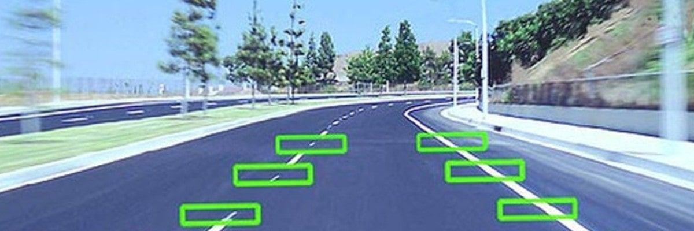
  </div>
  <div align="center">
    б)
    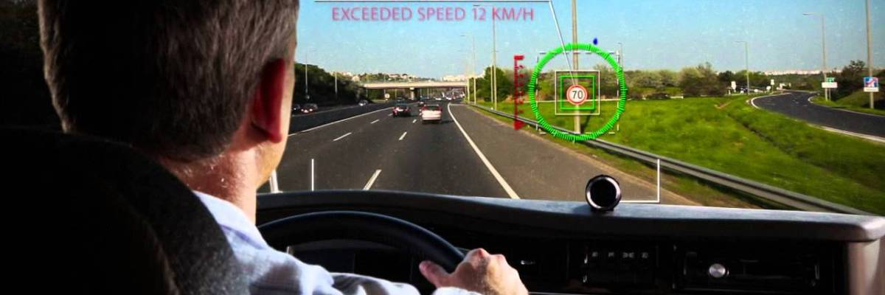
  </div>
  <div align="center">
    в)
    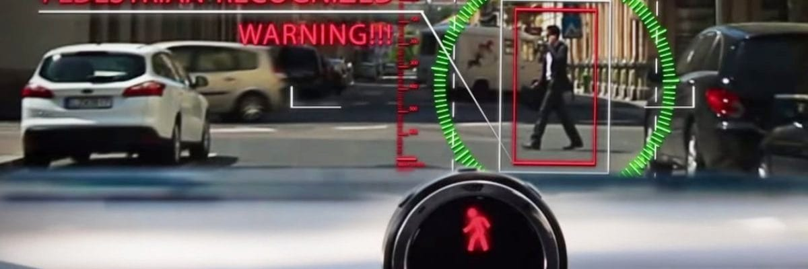
  </div>
  <div align="center">
    г)
    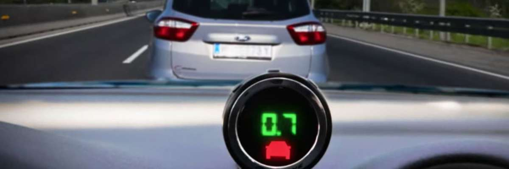
  </div>

  Рисунок 4 – Задачи, решаемые ADAS:  
  распознавание разметки (а), распознавание дорожных знаков (б), распознавание пешеходов (в),  
  определение расстояния до окружающих объектов (г)
</div>

Дальнейшим развитием системы помощи водителю стали системы беспилотного автомобиля, которые, используя те же базовые принципы и алгоритмы, позволяют управляющие решения делать без участия человека.

---

### 2.2 Особенности человеческой зрительной системы и их реализация в системах технического зрения

На прошлом занятии мы обсуждали некоторые особенности зрительной системы человека. Многие эти особенности были продиктованы законами физики и химии, особенностями существования жизни на Земле. Эволюция позволила за многие поколения получить орган, который хорошо решает множество задач и хорошо работает в условиях, наиболее благоприятных для существования человека. Технически решая схожие задачи для фотографии и цифровой фотографии, инженеры часто приходили к аналогичным решениям. Может показаться, что человек подсматривал решения в природе. Это не лишено смысла, так как эволюционное развитие часто подразумевает решение сложных задач с учетом физических ограничений. Перечислим особенности и их реализации в технике.

#### 2.2.1 Трехстимульность

Три типа цветоцувствительных клеток позволяют воспроизводить цвет объектов с использованием всего трех базовых цветов различной интенсивности. Это называется `метамерия`. В ранней живописи получение достаточно чистых цветов было затруднительно, потому что все пигменты в красках были естественного происхождения, и создать краситель с желаемыми характеристиками было затруднительно. Как только химия развилась как наука, с красками стало все гораздо интереснее. В результате появления телевидения и цифровой фотографии отпала необходимость в химических проводниках сигналов (как в биологии, так и в классической фотографии): появились цветные фильтры трех типов (условно красный, зеленый и синий - $R$, $G$, $B$). Для воспроизведения цвета нам сейчас достаточно трех базовых цветов ($RGB$), химические и финансовые ограничения могут менять эту стройную математическую картину, например, в области полиграфии, где используется множество красок (минимум 4 - $CMYK$: cyan, magenta, yellow, black; распространена печать в 6 цветов - cyan, magenta, yellow, black, orange, green; некоторые процессы поддерживают еще больше красок на листе - например, в палитру цветов добавляются light cyan и light black, обеспечивающие более плавное отображение градиентных переходов, и т.д.).

#### 2.2.2 Чувствительность к зеленому

Глаз наиболее четко распознает желто-зеленый цвет. Потому что это спектральные особенности нашего Солнца, которое светит сильнее всего в "зеленой" области спектра. Эта особенность нашла свое отражение в цифровой фотографии, в которой зеленый сигнал считается более важным и под него подстраиваются в первую очередь. Цветовые фильтры, про которые мы поговорим сегодня позже, половину информации собирают именно для зеленой части спектра. Оставшаяся половина делится между красным и синим. Зеленый цвет успокаивает, в зеленый красят поверхности интерьера для поддержания спокойного настроения.

> Вопрос: что еще в технике связано с зеленым цветом и отношением человека к нему?

#### 2.2.3 Аккомодация

Способность изменять световой поток очень быстро дошла до техники. В фотографии используют диафрагмы - специальные круговые шторки, обладающие возможностью регулирования проходящего светового потока. Идеальный случай для получения четкой фотографии (как и для четкого изображения): много света вокруг и маленькое отверстие пропускания в диафрагме. Причина в поведении света на разных частях оптических элементов объектива, как технического, так и биологического. В центральной части происходит меньше всего искажений. При этом весь остальной свет должен отсекаться диафрагмой.

<div align="center">
  <div align="center">
    а)
    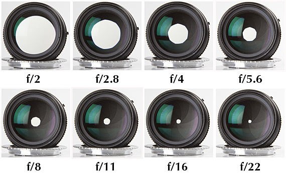
  </div>
  <div align="center">
    б)
    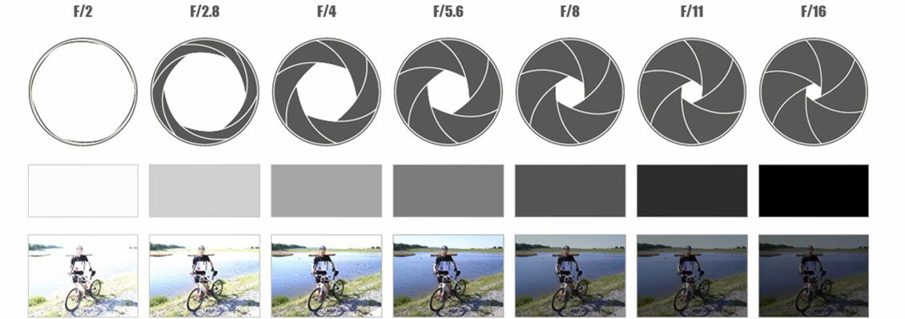
  </div>

  Рисунок 5 – Диафрагма объектива (а), пример получаемого изображения (б)
</div>

#### 2.2.4 Подвижность глаза, сканирование

Здесь техника и природа разошлись. Технически сложно реализовать подвижность для камеры. При этом весь сенсор обладает одинаковой чувствительностью в любой своей точке. Поэтому можно считать, что недостаток четкости всего глаза в среднем в биологическом варианте был решен за счет более плотной посадки чувствительных клеток и подвижности всего органа в целом. Техническая система лишена такого недостатка.

#### 2.2.5 Особенности возникающих нервных сигналов в глазу и в мозге

Особенность глаза в том, что он формирует трехстимульный сигнал, который собирается от чувствительных клеток трех типов (палочки сейчас некоторые ученые приравнивают по формируемому сигналу к синему цвету). Но при этом исследования показали, что в мозг приходит разностный сигнал. Этот сигнал состоит из ощущения общей яркости и положения цвета на шкалах красный-зеленый, синий-желтый. Это привело к появлению дополнительных цветовых пространств, с которыми эффективнее решать задачи по цветовой коррекции или оцифровывать разницу цветового ощущения (`CIE Lab`).

#### 2.2.6 Химическая природа вознакновения ощущения цвета

Природа зрения, использующая химические реакции, вызванные фотоэффектом, и способ регистрации непосредственно фототока отличаются. Поэтому в технике используется дополнительный алгоритм компенсации этой разницы. Изначально этот алгоритм возник при появлении телевидения и называется `гамма-компенсация`. Про него чуть подробнее поговорим сегодня и более подробно на одном из следующих занятий.

#### 2.2.7 Адаптация к условиям освещения

Способность человека воспринимать цвета одинаково при различном освещении реализовывалась в технике по-разному. Это и мощное белое освещение в студийных съемках раннего телевидения (проблема цвета осветителя просто отсекалась при помощи мощных белых софитов). В современных камерах применяется автоматическое или ручное балансирование точки белого. Про эти алгоримты мы поговорим подробно на следующих занятиях, так как они являются важной составляющей процесса получения цифрового изображения.

### 2.3 Способы регистрации изображения системами технического зрения

Основной принцип регистрации электромагнитного излучения в СТЗ и в естественных зрительных системах не отличается: чем больше излучения попало на чувствительный элемент, тем выше должен быть сигнал. Как мы помним, явление взаимодействия света с веществом, при котором энергия фотонов передаётся электронам вещества, называется фотоэффектом. Его изучением занимались на протияжении долгого времени различные ученые, в том числе Герц, Столетов, Эйнштейн.

<div align="center">
  
  
  Рисунок 6 – Альберт Эйнштейн
</div>

Для классической фотографии фотоэффект выражается в интенсивности химической реакции на пленке. Чем больше света попадает на участок, тем сильнее замутнение вещества и тем светлее этот участок на фотографии после печати. 

Для получения цифрового изображения принцип сохраняется - чем больше света (или ЭМ излучения другого спектра), тем выше электрический сигнал, поступающий от чувствительного элемента. Цифровые устройства регистрации изображений на основе фотоэффекта разрабатывались с середины ХХ века. Эволюция цифровой фотографии продолжается и сейчас. В качестве светочувствительных элементов выступают полупроводниковые элементы. На данный момент наиболее известны два подхода к регистрации цифровых изображений.  

1. `ПЗС` (`прибор с зарядовой связью`) - реализует передачу накопленного заряда (а значит, и информации об интенсивности света) с полупроводника при помощи последовательного сдвига заряда по цепи.
 
 <div align="center">
   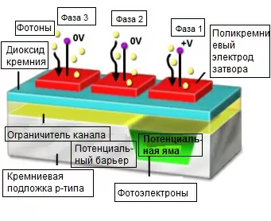
   
   Рисунок 7 – ПЗС-перенос
 </div>

2. `КМОП` (`комплементарная _структура_ металл-оксид-полупроводник`) - реализует преобразование сигнала непосредственно в светочувствительном элементе, что позволяет избежать некоторых проблем, присущих ПЗС.

 <div align="center">
   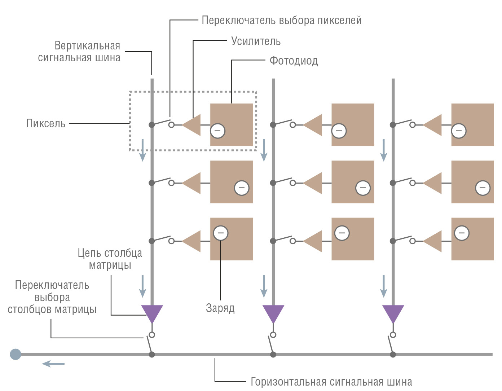
   
   Рисунок 8 – КМОП-считывание
 </div>

Проблемы ПЗС:
- растекание заряда (у старых матриц яркие пиксели передавали свой заряд соседям, вызывая засветку);
- построчное считывание, требующее времени (вызывает искажения у движущихся объектов).

<div align="center">
  <div align="center">
    а)
    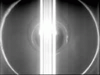
  </div>
  <div align="center">
    б)
    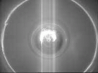
  </div>
  
  Рисунок 9 – Проблема растекания заряда в ПЗС-матрице:  
растекание заряда по линейке пикселей от засвеченного пикселя (а), изображение с более современной матрицы (б)
</div>

<div align="center">
  
  
  Рисунок 10 – Проблема построчного переноса информации (rolling shutter)
</div>

Съемка видео принципиально не отличается от съемки одиночных изображений. Естественной сложностью в данном случае становится скорость снятия информации с сенсора. Одним из способов решения проблемы недостаточной ширины информационного канала является снижение эффективного разрешения при увеличении частоты кадров, что можно легко проверить на любом из ваших мобильных телефонов.

## 2.4 Цветные сенсоры

Как бы хорошо не работал фотодиод, у него есть одна неудобная особенность - он реагирует на свет практически одинаково, независимо от длины волны спектра (Эйнштейн конечно определил зависимость тока от длины волны падающего света, но при такой интенсивности, которая нас интересует для получения изображения, эффект становится малополезным). Для получения цветной фотографии нам необходимо разделить падающий свет по спектру как минимум на три диапазона по аналогии со зрительной системой человека. Это разделение осуществляется за счет применения специального цветового фильтра, который устанавливается напротив каждого чувствительного элемента. Наиболее широкое распространение получил фильтр, где цветовые элементы расположены как $RGGB$ . Такой фильтр называется фильтром Байера в честь доктора Брайса Байера, который его придумал и запатентовал, когда работал в фирме Kodak.

<div align="center">
  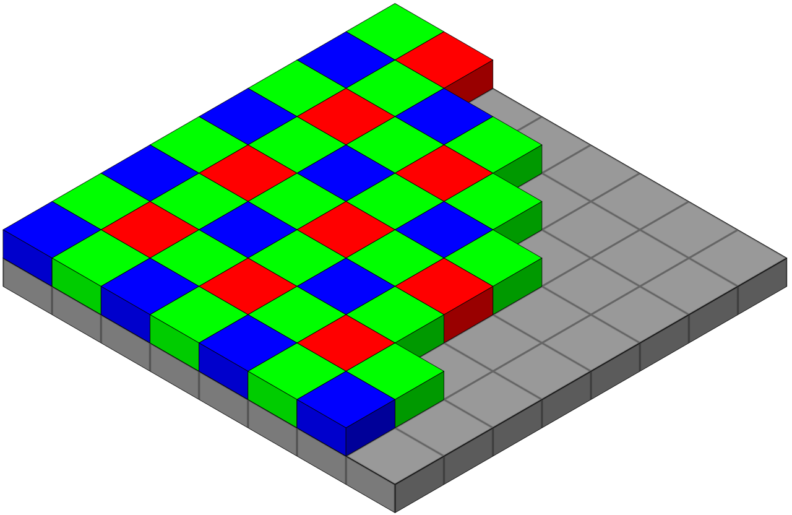
  
  Рисунок 11 – Фильтр Байера
</div>

Основная идея такой фильтрации - превратить чувствительные элементы матрицы в аналог колбочек разного типа на сетчатке глаза человека. Таким образом весь массив элементов разбивается на элементы, чувствительные к изменениям в красном (25%), зеленом (50%) и синем (25%) участках спектра. Зеленому отдано большее количество элементов, чтобы увеличить пространсвенное разрешение в той области спектра, в которой человек обладает наибольшей чувствительностью. Существует множество других типов таких фильтров, например фирма Huawei использует на своих флагманских смартфонах (P30 Pro, P40, P40 Pro, P60 Pro) сенсор с фильтром $RYYB$, где зеленые ($G$) элементы заменены на желтые ($Y$ - yellow). Это вносит свои трудности при работе с цветами изображений, получаемых с такого сенсора. В [пресс-релизе](https://consumer.huawei.com/en/community/details/P30-P30-RYYB-Sensor-See-Through-the-Dark/topicId_5180/) сообщается, что замена стандартного фильтра $RGGB$ на $RYYB$ привела к увеличению динамического диапазона камеры смартфона Huawei P30 Pro. Данное новшество позволяет получать более четкие и насыщенные фотографии в условиях недостаточной освещенности:

<div align="center">
  <div align="center">
    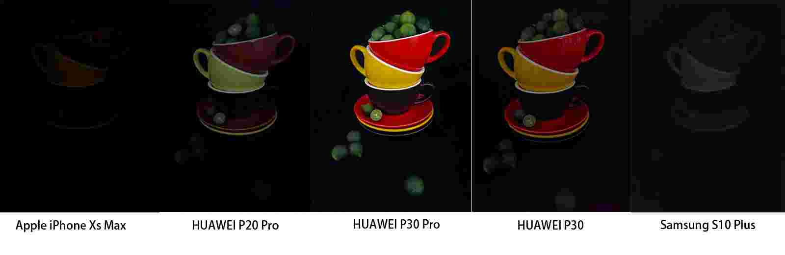
  </div>
  <div align="center">
    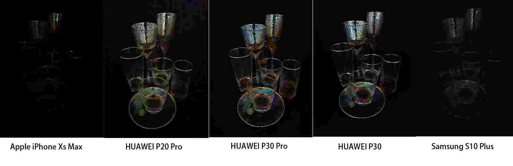
  </div>
  
  Рисунок 12 – P30 RYYB Sensor: See Through the Dark
</div>

> Интересно, что Huawei отказалась от применения фильтра $RYYB$ в модели P50 Pro из-за проблем, связанных с [цветопередачей](https://3dnews.ru/1059046/obzor-huawei-p50-pro). Однако, в модели P60 Pro он снова появился. Причем, [все три сенсора камеры получили $RYYB$ светофильтры](https://3dnews.ru/1086701/obzor-huawei-p60-pro).

Различные варианты фильтрации дают различные эффекты по сравнению с $RGGB$, например:
- $RGBE$ ($E$ - emerald - изумрудный, близкий к зелено-голубому) - дает более плавное изменение цвета при переходе от зеленого к синему, например листва-небо;
- $CYGM$ ($C$ - cian, $M$ - magenta) - такой вариант обладает большей светочувствительностью, но выдает цветовое пространство в итоге хуже, чем $RGGB$;
- $RGBW$ ($W$ - white - отсутствие фильтра для одного пикселя) - обладает большей светочувствительностью, но менее качественной цветопередачей.

Логично, что наиболее высокое пространственное разрешение получается при отсутствии цветового фильтра вообще. Тогда каждый фотодиод работает как отдельный чувствительный элемент. При получении цветного изображения цветной пиксель получается из четырех смежных пикселей разного цвета, тем самым снижается эффективное пространственное разрешение.

По аналогии с чувствительностью колбочек в глазу человека цветовые фильтры определяются кривой пропускания света для каждого заданного элемента. У разных производителей матриц могут использоваться фильтры с разной чувствительностью. Это помимо прочих нюансов влияет на итоговое впечатление от результата съемки ("Sony - желтит, а Canon - синит")

## 2.5 Динамический диапазон

Под динамическим диапазоном сенсора понимается максимальное количество различных уровней яркости, регистрируемых одновременно. Фактически это заложенная в устройство регистрации битность регистрируемого сигнала. Если упростить, то это количество градаций, которое может различить сенсор и предоставить в итоговом варианте. Чем выше динамический диапазон камеры, тем больше деталей можно увидеть на изображении одновременно. Человеческий глаз в смысле динамического диапазона обладает внушительными показателями (20 стопов = $2^{20}$ ступеней), но на этот факт оказывают влияние множество факторов:
- накопление зрительной информации в мозгу;
- постоянное движение глаза;
- аккомодация (подстройка к изменяющемся условиям освещения);
- внутренняя обработка в мозгу. 

Современные камеры могут обладать даже более высокой чувствительностью, но в большинстве случаев оценить такую чувствительность без использования специальных средств воспроизведения полученных изображений не получится. Возникает необходимость кодировать такой объем информации, а потом и воспроизводить его. Если нет подходящего устройства, то можно воспользоваться компромиссным решением - синтетическим $HDR$-изображением, которое получается из нескольких изображений, снятых с разным количеством пропускаемого света. На каждом из составляющих изображений максимум деталей приходится на разные области кадра, обладающие разной освещенностью. Эта информация собирается, уровни яркости изменяются, и из нескольких обработанных изображений получается одно.

<div align="center">
  
  
  Рисунок 13 – $HDR$-фото, синтезированное из нескольких фотографий и упакованное в стандартный $RGB$
</div>

> Реалистичность изображения уменьшается, но зрительный эффект увеличивается.

<div align="center">
  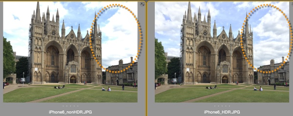
  
  Рисунок 14 – Пример фото одного объекта, снятое в двух режимах: обычном и $HDR$.
</div>

> Обратите внимание на выделенный фрагмент облака, за счет понижения яркости внутри появились детали.

> Если рассматривать фрагменты такого изображения по отдельности, то они будут похожи на реальность, детализация будет соответствовать тому, что способен различить глаз человека. Но изображение целиком выглядит нереальным. Для полноценного эффекта нужно устройство, способное одновременно выводить большое количество ступеней яркости.

Влияние низкого динамического диапазона на СТЗ особенно сильно ощущается при съемке в движении, когда нет возможности настроить освещение, происходит прямая засветка солнцем, важные объекты могут находиться в тенях. Особенно сильно такое влияние сказывается в системах безопасности, установленных на улице и в системах помощи водителю.

<div align="center">
  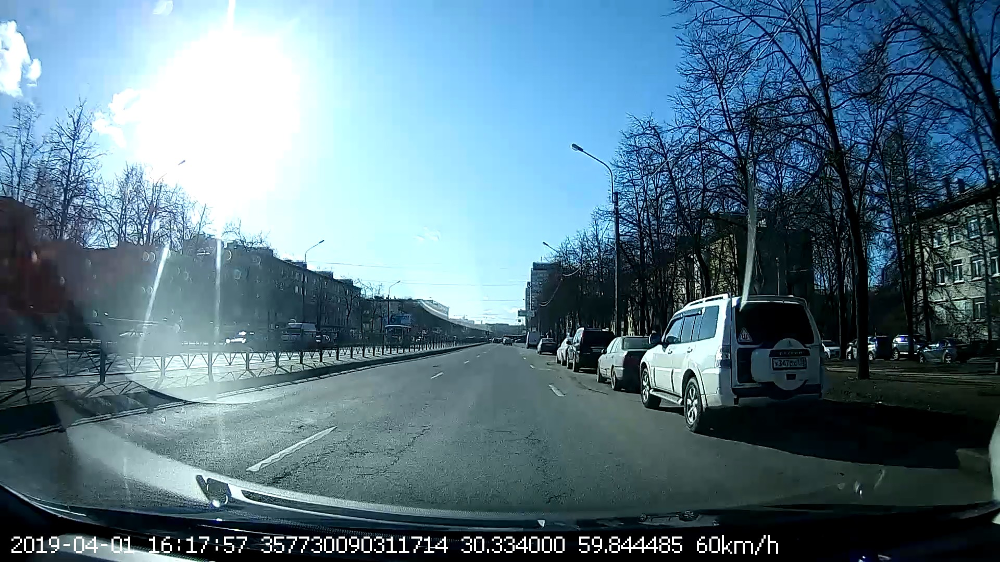
  
  Рисунок 15 – Недостаточный динамический диапазон для съемки на улице
</div>

> Прямая засветка солнцем не позволит надежно выделить, например, дорожный знак.

## 2.6 Гамма преобразование

Еще одной проблемой, связанной с динамическим диапазоном, является необходимость максимизировать количество деталей в наиболее информативной области освещенности. Наши глаза видят иначе, чем камеры. В цифровой камере удвоенное количество фотонов, попадающих на сенсор, означает удвоение сигнала (зависимость «линейна»). Однако, наши глаза как и пленка в классическом фото устроены иначе. Для нас увеличение освещённости вдвое означает, что свет по ощущениям стал слегка ярче (зависимость «нелинейна»). Если занимались работой со звуком, то там точно такая же история. Кстати, линейным $RGB$ называется именно изображение без гамма-коррекции. Коррекция практически однозначна, поэтому переход от линейного к нелинейному варианту не вызывает трудностей.

<div align="center">
  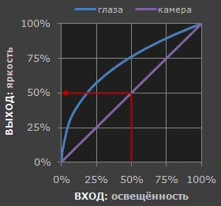
  
  Рисунок 16 – Физика зрения отличается от физики регистрации
</div>

По сравнению с камерами мы более чувствительны к малейшим изменениям тёмных оттенков и менее чувствительны к достаточно большим изменениям в ярких тонах. Для такой странности есть свои биологические причины: это позволяет нашему зрению работать в более широком диапазоне освещённости. В противном случае типичный диапазон яркостей, с которым мы сталкиваемся на улице, был бы невыносим. В данном случае гаммой мы называем преобразование показаний камеры к светочувствительности наших глаз. Когда сохраняется цифровое изображение, оно подвергается «гамма-кодированию» — так чтобы удвоение значения в файле ближе соответствовало тому, что мы воспринимаем как удвоение яркости.

Гамма-кодированные изображения сохраняют оттенки более эффективно. Поскольку гамма-кодирование перераспределяет тональные уровни ближе к тому, как их воспринимают наши глаза, для описания выбранного диапазона тонов требуется меньше места в информационном смысле. В противном случае на яркие тона (где камера имеет большую чувствительность) выделялось бы чрезмерно много места (битов в представлении), а на тёмных тонах (где камера менее чувствительна) сказывалась бы их нехватка.

<div align="center">
  <div align="center">
    а)
    
  </div>
  <div align="center">
    б)
    
  </div>
  
  Рисунок 17 – Фото без гамма-кодирования (а) и с гамма-кодированием (б)
</div>

Гамма-кодирование задается формулой:

```math
I_{out}=I_{in}^{\gamma}
```

где $I_{in}$ - значения яркости входного изображения (или его отдельного канала), распределенные в $[0,1]$, 
$I_{out}$ - значения яркости выходного изображения (или его отдельного канала) $\in[0,1]$,
$\gamma$; - значение коэффициента гамма-коррекции, обычно равное $2,2$ для кодирования линейного значения в гамма-корректированное и $^1/_{2,2}$ для преобразования из гамма-корректированного в линейное значение.

Помимо использования гамма-кодирования для сжатия информации об оттенках сейчас применяется множество других вариантов, нацеленных на максимизацию эффективности хранения. К таким форматам можно отнести различные `log`-кривые. Таких форматов множество и работа с ними принципиально не отличается от работы с гамма-кривой. Однако, для правильной работы с изображениями, нужно знать, как именно было закодировано изображение. Несмотря на непривычный вид простыми преобразованиями из него можно получить яркую и насыщенную картинку с правильной передачей цветов (считается, что даже с более правильной, чем при использовании гамма-преобразования).

<div align="center">
  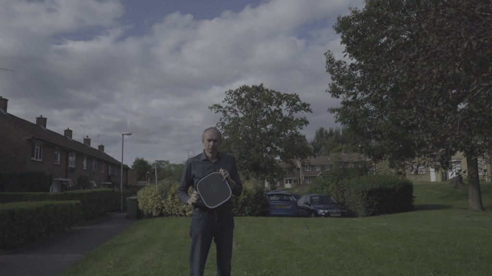
  
  Рисунок 18 – Фото, закодированное в log-кривой
</div>

> Изображение сильно отличается от привычного нам.

## 2.7 Получение изображения в стандартном цветовом пространстве. Простейший информационный тракт

Итак, у нас есть сенсор, который состоит из матрицы светочувствительных элементов. Сенсор способен распознавать и сохранять информацию о градациях света, попавшего на каждый его элемент. Перед каждым элементом установлен элементарный цветовой фильтр, обладающий своей спектральной характеристикой пропускания света. В самом простейшем случае на выходе из устройства мы получаем значения сигнала, которые соответствуют яркости одного из трех цветов в соответствующих пикселях. Если мы эту информацию не будем обрабатывать, а предоставим пользователю как есть, то у нас получится $RAW$-формат изображения. Этот формат не учитывает информацию об условиях съемки, информацию об используемом цветовом фильтре. Только данные о яркости.

Что нам нужно, чтобы сохранить эту информацию в стандартное цветовое пространство? Выполняются обычно [следующие шаги](https://habr.com/ru/post/516228/):
1. Загрузить линейные данные из файла $RAW$ и вычесть уровни чёрного. Что мы будем считать черным на изображении.
2. Провести балансировку белого. Какие цвета при условиях нашей съемки считаются нейтральными (градациями серого).
3. Подправить линейную яркость. Привести яркости каналов изображения к заданному количеству уровней.
4. Обрезать данные изображения. Удалить лишнюю информацию, оставшуюся в каналах.
5. Восстановить исходное изображение из мозаики (`дебайеризация`). Применить наши знания об использованном массиве цветовых фильтров.
6. Применить преобразования и коррекции цветов. Тут нужно применить знания о том, какая чувствительность была у наших сенсоров. Фактически съемка была проведена во внутреннем цветовом пространстве устройства, а нам нужно перейти к стандартному или к заданному. Об этом чуть позже.
7. Применить гамму. Наконец, переход от линейного изображения к нелинейному. Финиш, мы получили изображение.

Данные шаги в том или ином виде выполняются при получении любого изображения или видео с испольованием цифрового сенсора. На выходе мы получили изображение, заданное в пространстве $sRGB$.

Что такое пространство $sRGB$, мы обсуждали на предыдущей лекции. $sRGB$ является стандартом представления цветового спектра с использованием модели $RGB$. $sRGB$ создан совместно компаниями HP и Microsoft в 1996 году для унификации использования модели $RGB$ в мониторах, принтерах и интернет-сайтах.

## 2.8 Гиперспектральные изображения. Синтезирование цвета

Немного иначе дела с изображениями обстоят в еще одной важной области применения СТЗ - гиперспектральной съемке. Если в стандартном цветном изображении у нас всего 3 "условно не пересекающихся" канала информации, то в гиперспектральном изображении таких каналов может быть сотни. Процесс получения гиперспектрального изображения в общих чертах прост: свет, пришедший к сенсору от одной точки снимаемой сцены, раскладывается при помощи призмы в спектр (радуга, привет экспериментам Ньютона) и весь этот спектр регистрируется. У нас появляется возможность записать гораздо больше информации об объектах. Теперь каждый пиксель изображения описывается не тремя числами, а парой сотен. И в этих числах зашифрован не предполагаемый отклик человеческого глаза - цвет, а спектральный состав света. Такой пиксель меняет свое название на "гиперпиксель".

<div align="center">
  <div align="center">
    а)
    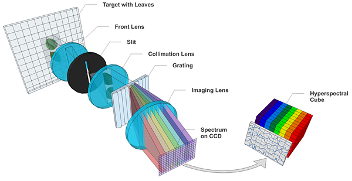
  </div>
  <div align="center">
    б)
    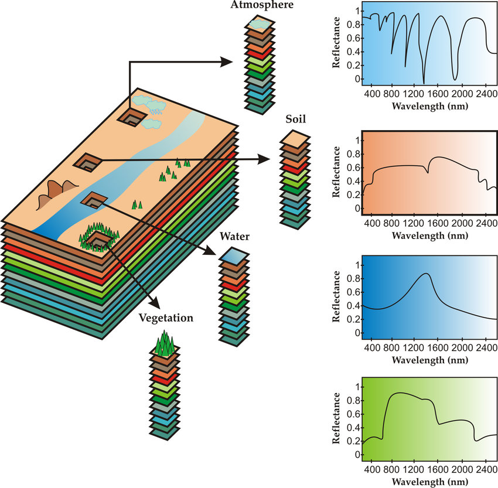
  </div>
  
  Рисунок 19 – Гиперспектральная аэросъемка:  
  оптическая схема гиперспектрометра (а), спектральные профили различных объектов (б)
</div>

Для таких изображений является не самой простой задачей получение цветного (3-канального) изображения. С этим обычно помогает справиться кривая чувствительности, про которую мы говорили в первой лекции. Гиперспектральные изображения могут быть очень полезными при калибровке различных камер и для систем технического зрения, когда съемка объектов производится одновременно на исследуемое устройство и на гиперспектральную камеру. Огромное количество информации, содержащейся в гиперспектральном снимке, позволяет проводить точнейшую калибровку оборудования. Но обычно такая роскошь недоступна. И каждое устройство снимает в некотором своем внутреннем цветовом пространстве. Здесь мы подходим к завершающей части сегодняшней лекции.

## 2.9 Цветовые профили устройств

Итак, у нас есть проблема: устройство, снимающее на какие-то свои сенсоры, осуществляющее какую-то внутреннюю обработку. Как сделать так, чтобы все, что мы наснимали на это устройство, отображалось одинаково на всех выпущенных устройствах? Мы можем померить цвета одного изображения на любой паре устройств и получить преобразование (или даже комплекс преобразований), которое позволит переводить цифры цветов изображения с одного устройства в цифры для другого устройства. Это будет работать, мы это умеем. Есть трудность: устройств настолько много, что задача в таком виде нерешаема. Нам бы пришлось строить такое преобразование для нашей железки и ***каждого*** девайса, что уже был выпущен раньше.

Решение этой задачи достаточно простое и элегантное - строить преобразование цветов не для всех устройств, а только для одного цветового пространства. Универсального, базового и всем хорошо известного. Например $XYZ$. Таким образом, каждое вновь создаваемое устройство можно снабдить одним единственным преобразованием, которое свяжет внутреннее цветовое пространство и универсальное пространство.

<div align="center">
  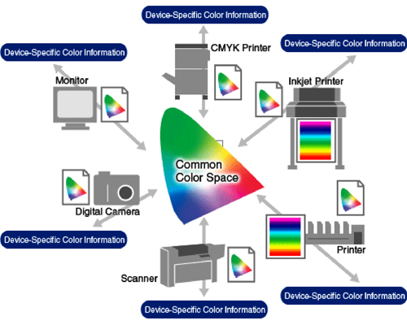
  
  Рисунок 20 – Цветовые профили устройств
</div>

Сами профили могут быть сложными алгоритмами по преобразованию цвета. Согласно таким алгоритмам, например, проходит обработка изображений при работе цифровой камеры. Эти алгоритмы-профили могут калиброваться и настраиваться дополнительно в зависимости от условий работы. Например, всегда можно откалибровать монитор для наилучшей передачи цветов в определенных условиях работы.


<div align="center">
  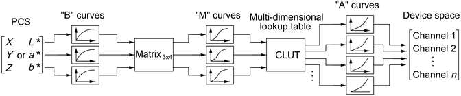
  
  Рисунок 21 – Состав цветового профиля
</div>

> Множество различных преобразований, не только линейных.

В профилях, как и в алгоритмах цветового преобразования, все не ограничивается только лишь линейными составляющими. Нелинейные изменения практически всегда присутствуют там, где присутствуют различные физические процессы. Именно к нелинейным преобразованиям можно отнести гамма-коррекцию изображений, так что нелинейность не должна пугать возможными сложностями.