# Цифровая обработка изображений

© Бибиков С.А., к.т.н., доцент кафедры суперкомпьютеров и общей информатики, Самарский университет

## Лекция 3. Информационный тракт создания цифровых изображений

## Содержание

0. [Полезные ссылки](#30-полезные-ссылки--дополняемо-)
1. [Общее описание простейшего информационного тракта](#31-общее-описание-простейшего-информационного-тракта)
2. [Получение и чтение RAW изображения](#32-получение-и-чтение-raw-изображения)
3. [Определение уровней черного](#33-определение-уровней-черного)
4. [Коррекция пространственных аберраций](#34-коррекция-пространственных-аберраций) (**это отличная тема для проработки вместо лабораторных**)
5. [Дебайеризация](#35-дебайеризация)
6. [Функциональное уменьшение шума](#36-функциональное-уменьшение-шума) (**это отличная тема для проработки вместо лабораторных**)
7. [Коррекция баланса белого и переход в универсальное цветовое пространство](#37-коррекция-баланса-белого-и-переход-в-универсальное-цветовое-пространство)
8. [Нелинейное отображение оттенка и насыщенности](#38-нелинейное-отображение-оттенка-и-насыщенности)
9. [Коррекция экспозиции](#39-коррекция-экспозиции)
10. [Изменения цвета](#310-изменения-цвета)
11. [Тоновая коррекция](#311-тоновая-коррекция)
12. [Переход в целевое линейное цветовое пространство ($linear RGB$)](#312-переход-в-целевое-линейное-цветовое-пространство--linear-rgb-)
13. [Гамма преобразование и переход в sRGB](#313-гамма-преобразование-и-переход-в-srgb)
14. [Потери информации](#314-потери-информации)

### 3.0 Полезные ссылки (дополняемо)

- Много полезной информации было найдено в [Рендер изображения формата RAW](https://habr.com/ru/post/516228/). Оттуда же взяты иллюстрации к результатам, которые получаются после некоторых операций.
- [Hakki Can Karaimer](https://karaimer.github.io/). Личное хранилище ученого, который помогал вести курс `Computational photography` в `EPFL`. Немного статей с хорошими картинками и умными словами.

### 3.1 Общее описание простейшего информационного тракта

В процессе создания цифровых изображений решается множество частных задач. Набор методов решения этих задач формируюет информационный тракт получения цифровых изображений. Обработка получаемой информации начинается в момент снятия информации о накопленном заряде с элементов сенсора. Вдаваться в особенности низкоуровневой обработки сигналов, которая происходит в логических схемах мы не будем. Мы сконцентрируемся на более высоком уровне обработки, которую условно можно начать с изображений, за которые можно принять изображения в формате `Camera Raw` (***raw*** - сырой). Техническая эволюция привела к тому, что многие используемые в тракте алгоритмы (а особенно нейронные сети) решают сразу несколько задач. При этом границы между функциональными этапами стираются. В учебных целях мы будем рассматривать самые стандартные из решаемых задач.

В [статье](https://karaimer.github.io/beyond-rawRGB-sRGB/paper/Karaimer_Brown_CIC19.pdf) приведена неплохая иллюстрация, которую я без зазрения совести использую в рисунке 1.

<div align="center">
  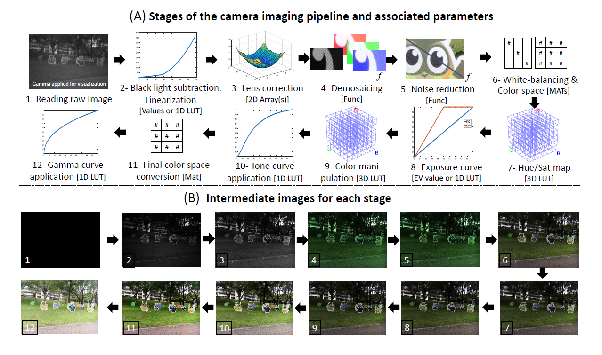
  
  Рисунок 1 –  Стандартные операции, совершаемые при получении цифрового изображения
</div>

Перечислим на русском языке решаемые задачи:
1. Чтение Camera Raw изображения.
2. Определение уровней черного.
3. Коррекция пространственных аберраций (**отличная тема для проработки вместо лабораторных**).
4. Дебайеризация.
5. Функциональное уменьшение шума (**это отличная тема для проработки вместо лабораторных**).
6. Коррекция баланса белого и переход в универсальное цветовое пространство.
7. Нелинейное отображение оттенка и насыщенности (*магия*).
8. Коррекция экспозиции.
9. Изменения цвета (*магия*).
10. Тоновая коррекция.
11. Переход в целевое линейное цветовое пространство ($linear RGB$).
12. Гамма преобразование и переход в $sRGB$.

Разберем теперь каждую задачу чуть подробнее.

### 3.2 Получение и чтение RAW изображения

Как мы уже говорили раньше, в сенсорах преобразование интенсивности падающего света преобразуется в электрический заряд по линейному принципу, в отличие от естественных зрительных систем, где преобразование связано с химическими реакциями. При этом битность сигнала (количество уровней изменения освещенности) современных сенсоров достаточно высокая, по крайней мере, часто больше 8 битов. Для удобства цифровой обработки его обычно принимают за 16 битный сигнал (то есть способный изменяться в пределах от $0$ до $65535$). В принципе, сложностей с получением самого сигнала нет никаких. С учетом того, что в большинстве случаев мы не сможем забраться в аппаратную логику сенсора, будем считать, что файл в формате `Camera Raw`  

> Важно! `.Raw` это проприетарный формат Adobe. Не перепутайте.  

это то, что получается непосредственно с матрицы. У профессиональных цифровых фотокамер, так же как и у многих специальных научных камер и сенсоров, есть возможность сохранять изображения непосредственно в `Camera Raw` формате. Для эмуляции этого процесса для мобильных устройств можно воспользоваться различными сторонними приложениями для `Android` (например `ON1 Photo RAW for Mobile` в [Google Play](https://play.google.com/store/apps/details?id=com.on1.onmobile)), для телефонов `Apple` есть встроенный функционал в самой ОС для работы с $RAW$ форматом. Для работы с камерой ноутбука придется повозиться, так как это обычно не предусмотрено создателями драйверов (могут пригодиться программы с открытым кодом [LibRaw](https://www.libraw.org/download)/[dcraw](https://www.dechifro.org/dcraw/index_ru.html)). В любом случае, для проведения опытов и обучения можно скачать нужный файл из сети, но в этом случае придется изучить спецификацию файла.

### 3.3 Определение уровней черного

Записанные данные в исходном файле будут находиться в линейном соотношении с яркостью света. Но это касается не всего диапазона. В самых темных областях данные хранятся со смещением, зависящим от камеры и канала. Уровни чёрного (т.е. значения для черного на сцене, "полное отсутствие света") имеют величины, отличные от нуля, и их нужно вычесть из оригинальных необработанных данных, чтобы нулевая интенсивность пикселей совпадала с нулевым количеством света. Это можно сделать и вручную. Для этого фотографы часто делают снимок с закрытой крышкой объектива, чтобы позже использовать эту информацию для определения поведения сенсора. Уровни могут быть неодинаковыми для разных участков камеры. На рисунке 2 представлено существенно усиленное изображение (по насыщенности и интенсивности) такого "черного" кадра.

<div align="center">
  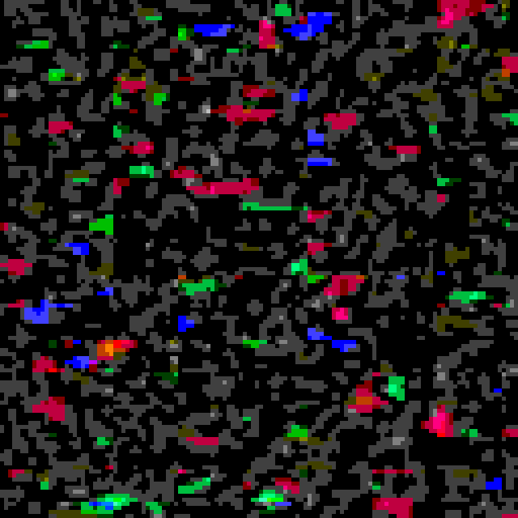
  
  Рисунок 2 –  Шум на черном кадре (усиленное по насыщенности и интенсивности изображение)
</div>

Такой шум иногда обусловлен тепловым шумом сенсора - перетеканием зарядов между ячейками из-за несовершенства выращенного кристалла матрицы и наличия теплового движения молекул. Для вычитаня этих уровней могут использоваться разные величины: максимальное или среднее значение в черном кадре, например. Корректнее использовать стандартное отклонение. В автоматическом режиме устанавливается отсечка по интенсивности, которая строится за счет преобразования гистограммы значений яркости к единому значению $0$.

После проведения этой операции кадр приобретает вид, на котором уже можно различать детали.

<div align="center">
  <div align="center">
    a)
    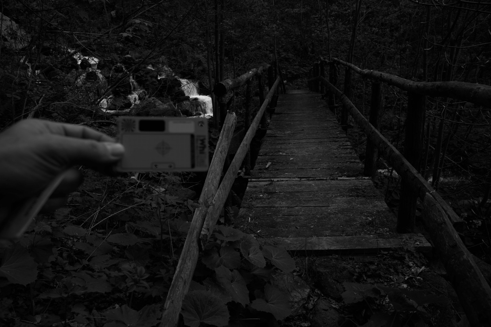
  </div>
  <div align="center">
    б)
    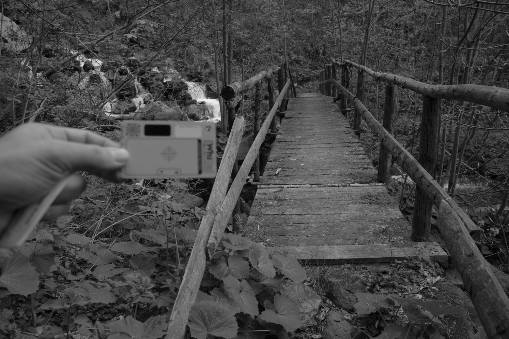
  </div>

  Рисунок 3 – Результат коррекции уровней черного: исходное изображение (а), результат коррекции (б)
</div>

Обычно для этого в камерах используют заранее просчитанные $1D LUT$ (**Look Up Table**) - таблицы поиска - оцифрованные значения функции от одной переменной. Это применяется для существенного сокращения времени на вычисление этой функции. В массиве быстрее искать значение, чем ситать его по аналитически заданному соотношению.

### 3.4 Коррекция пространственных аберраций

> Это отличная тема для проработки.

Если кратко, то это исправление пространственных искажений кадра, которые вносятся оптической системой объектива. Причина возниконовения аберраций - разный показатель фокуса для разных частей линзы. Современные объективы обладают меньшими искажениями, по сравнению с однолинзовыми образцами на заре фотографии.

<div align="center">
  <div align="center">
    a)
    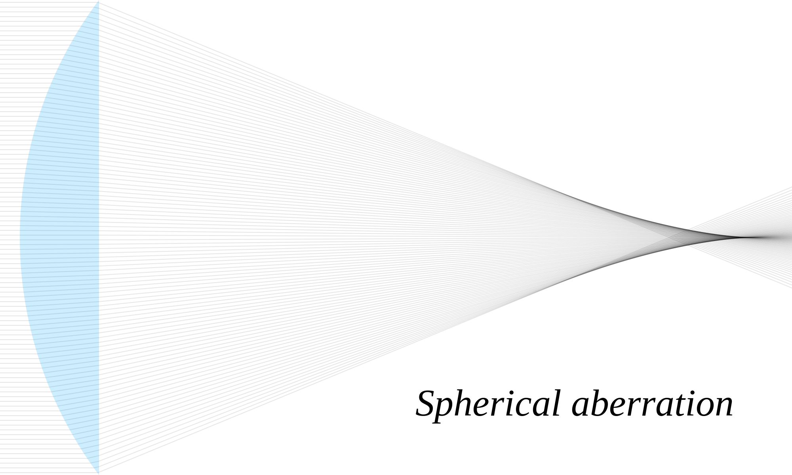
  </div>
  <div align="center">
    б)
    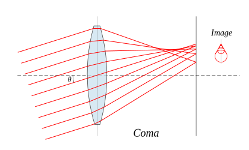
  </div>
  <div align="center">
    в)
    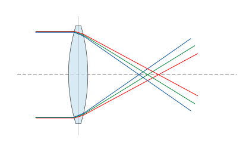
  </div>

  Рисунок 4 – Аберрации оптической системы: сферическая (а), кома (б), хроматическая (в)
</div>

### 3.5 Дебайеризация
Изображение на рисунке 5 выглядит как полноценное чёрно-белое (в градациях серого, если быть точнее) из-за малого размера, но на самом деле это не так: даже на одинаково освещённых участках видна пикселизация. Это происходит из-за того, что соседние цветовые фильтры, имея разную спектральную чувствительность, собирают разную информацию о цветах. Это легко видно при увеличении изображения.

<div align="center">
  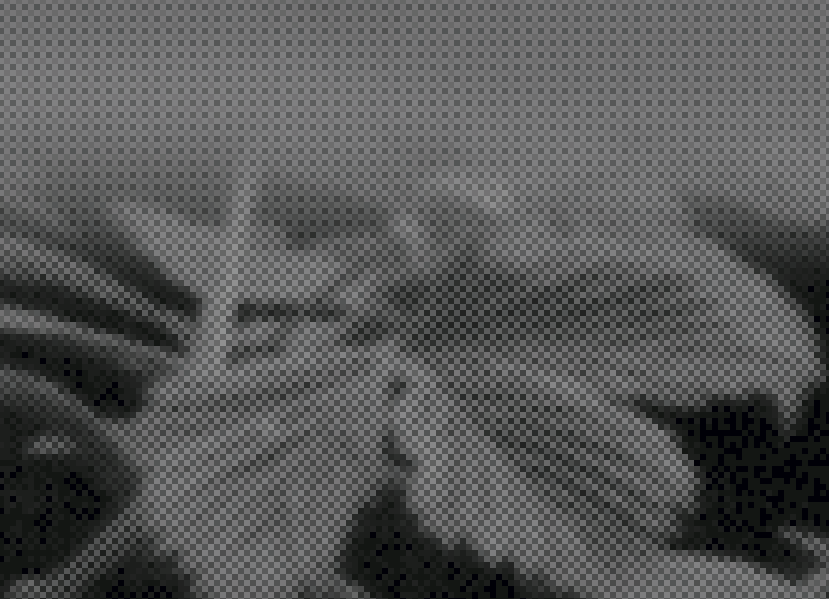
  
  Рисунок 5 –  Пикселизация из-за фильтра Байера на камере
</div>

Процесс получения псевдоцвета может проходить в нескольких вариантах. Например, можно из 4х базовых пикселей собирать 1. Тогда линейное разрешение уменьшится вдвое. Можно использовать подход, представленный на рисунке 6.

<div align="center">
  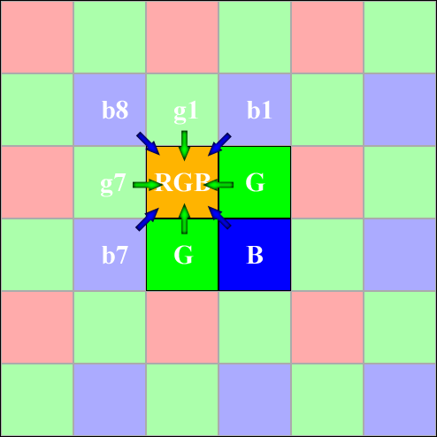
  
  Рисунок 6 –  Дебайеризация
</div>

Значение красного пикселя в данном случае используется как есть. А зеленый и синий с использованием четырех ближайших соседей.

При этом на этапе дебайеризации можно провести еще одну операцию, которая направлена на коррекцию шума, который в английском языке называется `salt&pepper` (`соль и перец`). Шум выражается в появлении абсолютно черных и абсолютно белых пикселов. Берые пикселы, это пикселы, которые всегда имеют максимальный заряд, например из-за деградации или брака кристалла. Черные пикселы - выгоревшие элементы, которые потеряли способность накапливать заряд. Исправление этих значений осуществляется за счет интерполяции по соседним одноцветным элементам.

<div align="center">
  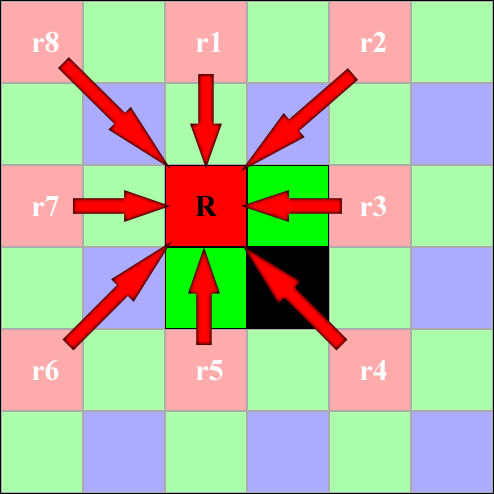
  
  Рисунок 7 –  Коррекция выгоревшего пикселя с помощью интерполяции
</div>

Результат дебайеризации можно проиллюстрировать рисунком 8.

<div align="center">
  <div align="center">
    a)
    
  </div>
  <div align="center">
    б)
    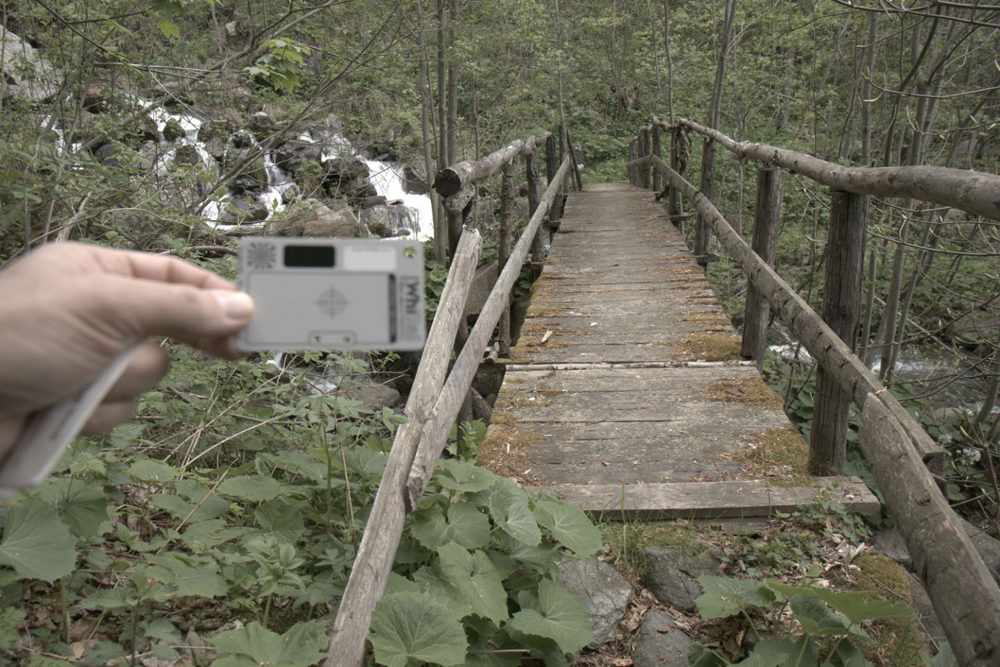
  </div>

  Рисунок 8 – Получение цветного изображения после дебайеризации: исходное изображение в градациях серого (а), результат дебайеризации (б)
</div>

На данном этапе изображение приобретает более привычный вид, но до конечного результата еще много шагов. Математический аппарат для этой операции - простейшие фильтры со скользящим окном.

### 3.6 Функциональное уменьшение шума

На этом этапе проводится удаление шумов с использованием различных функций. При этом от соли с перцем мы избавились на предыдущем шаге и здесь применяются более сложные алгоритмы, нацеленные на повышение качества изображения. Часто здесь можно увидеть работу нейронной сети, не только по устранению шума, но и по повышению контрастности.

### 3.7 Коррекция баланса белого и переход в универсальное цветовое пространство

После дебайеризации становится понятным, все ли в порядке у изображения с передачей нейтральных тонов. Коррекция белого работает в предположении, что самый яркий объект на изображении должен восприниматься человеческим глазом как белый. Тут есть своя логика, белые предметы, как правило, отражают свет лучше всех остальных. Это не всегда так, особенно если в кадре есть источники света. О различных алгоритмах автоматической коррекции белого мы поговорим позже. Задача этих алгоритмов заключается в построении простой диагональной матрицы с тремя значениями. 

Шаги по коррекции точки белого в указанных предположениях:
1. Выбор наиболее яркого объекта на изображении.
2. Построение преобразования, которое переводит самый яркий цвет на изображении в белый цвет.

```math
\begin{matrix}
\frac{1}{R_w} & 0 & 0 \\
0 & \frac{1}{G_w} & 0 \\
0 & 0 & \frac{1}{B_w}
\end{matrix}
```

где $R_w$, $G_w$, $B_w$ - координаты цвета самого яркого объекта, который мы принимаем за белый.

3. Применение построенного преобразования ко всем цветам на изображении.
<div align="center">
  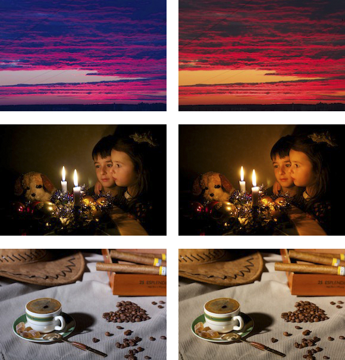
  
  Рисунок 9 – Примеры исправленного баланса белого
</div>

В простейшем варианте эти значения должны переводить белый (самый яркий, например) объект к цветам, кодируемым максимальными значениями каналов (поэтому матрицу нужно домножить на $65535$). Однако, если мы хотим сохранить как можно больше информации, число выбирается меньшим, чтобы в память влезли все "хвосты" (значения с высокой яркостью). Художественная или ручная обработка может подразумевать получение этих чисел в матрице иным способом. Но суть остается та же, получение матрицы $3\times3$, и применение ее к каждому пикселю изображения. Матрица используется для унификации применяемых методов. По факту это коэффициенты усиления каналов.  

После исправления (или определения) баланса белого осуществляется переход к универсальному цветовому пространсвту. Мы с вами пока еще не узнали подробности про разные цветовые пространства, но с математической точки зрения для задания преобразования для всех точек изображения достаточно построить так же матрицу $3\times3$, заполненную числами. В предположении, что черный цвет и $0$ мы уже соединили, нам дейстительно хватит преобразования $3\times3$.

### 3.8 Нелинейное отображение оттенка и насыщенности

Здесь происходит магия, которую производители коммерческих сенсоров и цифровых фотокамер держат в секрете. Это их способ сделать картинку более приятной глазу представителей целефой аудитории. От камеры к камере значения и алгоритмы могут меняться. Для быстрой реализации этого сложного и нелинейного процесса используют `3D LUT`. Тут также часто можно найти нейронные сети.

### 3.9 Коррекция экспозиции

На данном этапе принимается решение, что же на изображении будет считаться за максимум яркости. Тут происходит обрубание сохраненных "хвостов" и масштабирование к 16 битам. Преобразование, используемое здесь, является простым контрастированием с использованием линейной функции

```math
R_2 = k \cdot R_1 + a
R_{new}=\frac{R_2 - min(R_2)}{max(R_2) - min(R_2)}
```

Таким образом, получется изображение, чья яркость изменяется на всем диапазоне, доступном в 16 битном представлении на канал. Процедура простая и проводится либо с помощью прмого вычисления, либо с помощью `1D LUT`.

### 3.10 Изменения цвета

Здесь происходит вторая часть магии, которую производители коммерческих сенсоров и цифровых фотокамер держат в секрете. Цветовая коррекция и тонкая работа с цветом происходит именно здесь. Известно, что `iPhone` одной из последних моделей в этом месте "подкрашивал" небо в более голубой цвет. Для быстрой реализации этого сложного и нелинейного процесса используют `3D LUT`. Тут так же часто можно найти нейронные сети.

### 3.11 Тоновая коррекция

В принципе, данная процедура в автоматическом режиме проходит с помощью проведенных изготовителем измерений. Цель тоновой коррекции заключается в том, чтобы заданные яркости строго линейно соответствовали интенсивностям пикселей, и эти интенсивности можно было закодировать в меньший объем представления (то есть хоть как-то уместиться в стандартные 8 бит или нестандартные сколько-то, но которые поддерживает конкретное устройство отображения; ведь даже хорошие мониторы поддерживают контраст 1 к 500, а это условно 9 бит уровней яркости). Ручную коррекцию можно провести с использованием специальных таблиц с нанесенными точными и промерянными красками. Такие цветовые плашки потом позволяют выправлять идеальные изображения даже не смотря на неидеальные условия освещенности. Пример таких тестовых таблиц приведен на рисунке 10.

<div align="center">
  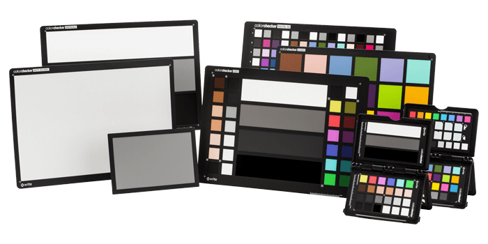
  
  Рисунок 10 – Таблицы для калибровки цвета при съемке
</div>

### 3.12 Переход в целевое линейное цветовое пространство ($linear RGB$)

Переход осуществляется так же, как и раньше. Только теперь мы точно знаем матрицу перехода из пространства $XYZ$ в пространство $linear RGB$. Эта матрица $3\times3$ применяется к каждому пикселю изображения. Если нам понадобится другое целевое пространство, будет использована матрица с другими коэффициентами. Для перехода в стандартное $sRGB$ пространство осталось выполнить один шаг. В принципе, можно поменять этот шаг с предыдущим, ничего не поменяется. Так как преобразование линейно, то есть обратимо, а работа с тоном полностью соответствует мощности сигнала. То есть полностью описывает физический процесс.

### 3.13 Гамма преобразование и переход в $sRGB$

Гамма преобразование может выполняться совместно с тоновой коррекцией и заменяться на другую функцию: $log$ или $exp$. Эту достаточно простую операцию мы обсудили на предыдущем занятии. После данного шага изображение готово к сжатию, хранению или передаче на другие устройства.

### 3.14 Потери информации

При выполнении каждого шага информационного тракта возможна потеря информации в смысле теории информации. Мы можем что-то обрезать и превратить шум в черный цвет, а слишком яркие объекты, которые не умещаются в доступный диапазон, в полностью белые. Можем потерять количество градаций при переходе от 16 битного представления к 8 битному (именно поэтому все вычисления следует выполнять с максимальной доступной точностью). И такая потеря информации на изображении происходит до сжатия, которое, в свою очередь, может вызвать еще большие потери в плавности перехода цветов в мелких деталях. Поэтому, если есть необходимость реализовать систему технического зрения с использованием стандартных камер, нужно по возможности работать с $RAW$ изображениями. При необходимости проводить преобразования изображений, лучшим решением было бы встраивание своего алгоритма в информационный тракт.
