# Цифровая обработка изображений

© Бибиков С.А., к.т.н., доцент кафедры суперкомпьютеров и общей информатики, Самарский университет

## Лекция 4. Разложение цветов. Дебайеризация

### Содержание

1. [Различные технологии цветоделения](#41-различные-технологии-цветоделения)
2. [Фильтр Байера](#42-фильтр-байера)
3. [Получение многоспектральных и гиперспектральных изображений](#43-получение-многоспектральных-и-гиперспектральных-изображений)
4. [Процесс дебайеризации (demosaicing)](#44-процесс-дебайеризации--demosaicing-).

### 4.1 Различные технологии цветоделения

Полезные ссылки:

1. [Статья про массивы цветных светофильтров @ wikipedia](https://ru.wikipedia.org/wiki/%D0%9C%D0%B0%D1%81%D1%81%D0%B8%D0%B2_%D1%86%D0%B2%D0%B5%D1%82%D0%BD%D1%8B%D1%85_%D1%81%D0%B2%D0%B5%D1%82%D0%BE%D1%84%D0%B8%D0%BB%D1%8C%D1%82%D1%80%D0%BE%D0%B2)
2. [Статья про Foveon X3-сенсор @ science.fandom.com](https://science.fandom.com/ru/wiki/Foveon_X3-%D1%81%D0%B5%D0%BD%D1%81%D0%BE%D1%80)
3. [Статья про 3CCD-сенсор @ science.fandom.com](https://science.fandom.com/ru/wiki/3CCD-%D1%81%D0%B5%D0%BD%D1%81%D0%BE%D1%80)

Принципы цветового зрения человека (трихроматизм) в техническом варианте требует разделения всего спектра оптического диапазона на $3$ части. Осуществляется это деление обычно за счет применения цветовых фильтров. При этом фильтр обладает пропускной способностью, определяемой его химическим составом и/или физическими свойствами, связанными с кристаллической решеткой. Кривые пропускной способности фильтра $r'(\lambda)$, $g'(\lambda)$, $b'(\lambda)$ совместно с кривой чувствительности сенсора $p(\lambda)$, примененные вместе к спектру регистрируемого света $C(\lambda)$, после обработки выдают следующие значения на соответствующих элементах сенсоров:

$$
\begin{matrix*}[l]
R=\int_{380}^{720} C(\lambda)\left[r'(\lambda)p(\lambda)\right]d\lambda = \int_{380}^{720} C(\lambda)\overline{r'}(\lambda)d\lambda \\
G=\int_{380}^{720} C(\lambda)\left[g'(\lambda)p(\lambda)\right]d\lambda = \int_{380}^{720} C(\lambda)\overline{g'}(\lambda)d\lambda \\
B=\int_{380}^{720} C(\lambda)\left[b'(\lambda)p(\lambda)\right]d\lambda = \int_{380}^{720} C(\lambda)\overline{b'}(\lambda)d\lambda
\end{matrix*}
$$

Следует обратить внимание на то, что спектральные характеристики фильтров совместно с энергетической эффективностью (или чувствительностью) сенсоров вообще образуют спектральную чувствительность сенсора $\overline{r'}(\lambda)$ к определенному цвету. Это прямая техническая аналогия спектральной чувствительности колбочки человеческого глаза $\overline{r}(\lambda)$ из предыдущих лекций. При этом эти функции в общем случае различаются: $\overline{r'}(\lambda)\neq\overline{r}(\lambda)$, то есть в итоге цвет, который "видит" камера, и цвет, который видит глаз "стандартного наблюдателя", будут описываться разными наборами чисел. Поэтому и необходимы различные цветовые преобразования и переходы к стандартным цветовым пространствам.

Как же происходит разделение светового потока для сенсоров, обладающих разной спектральной чувствительностью? Существует несколько подходов:
- разделение светового потока на несколько раздельных сенсоров (3CCD-сенсор)$
- разделение регистрирующих плоскостей сенсора в пространстве (Foveon X3-сенсор)$
- разделение цветового потока в каждом элементарном сенсоре (Nikon $RGB$-матрицы);
- и самый распространенный способ &ndash; применение массивов цветных светочувствительных фильтров.

#### `3CCD-сенсор`

`3CCD-сенсор` &ndash; устройство, основывающееся на технологии получения цветного изображения применением трёх раздельных сенсоров и дихроидных призм, делящих поток лучей света на три пучка: $RGB$ (красный, зелёный и синий). Каждый из этих пучков направляется на отдельную матрицу.

  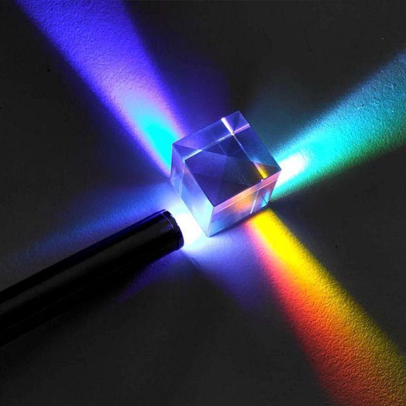
  
  Рисунок 1 &ndash; Пример работы дихроической призмы

  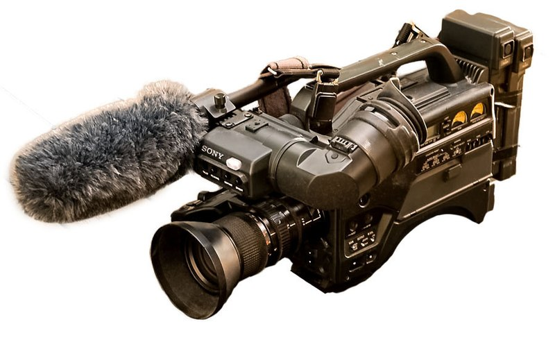
  
  Рисунок 2 &ndash; Камера, работающая на принципе разделения потоков дихроической призмой

**Преимущества:**
1. Лучшая передача цветов изображения, полное отсутствие цветного муара.
2. Отсутствие необходимых для восстановления потерянной информации алгоритмов, которые уменьшают эффективное разрешение.
3. Выше разрешающая способность (оптика). Отсутствует необходимый для устранения муара low-pass фильтр.
4. Выше светочувствительность и меньший уровень шумов благодаря отсутствию потерь в фильтрах.
5. Применение цветокоррекции установкой дополнительных фильтров перед отдельными матрицами (не перед съёмочным объективом), что позволяет добиться существенно лучшей цветопередачи при нестандартных источниках света с сохранением высокой чувствительности системы в целом.
6. Имеется возможность повышения эффективного разрешения сверх разрешения отдельной матрицы вдвое по одной из координат путем сдвига трех матриц друг относительно друга на $^1/_3$ пиксела и осуществления интерполяции трёх изображений с учётом этого сдвига. Данная технология получила наименование «Pixel shifting».

**Недостатки:**

1. Принципиально бо́льшие габаритные размеры.
2. Трёхсенсорная система не может использоваться с традиционным зеркальным видоискателем, а также с объективами с малым рабочим отрезком (задним вершинным расстоянием).
3. В трёхсенсорной схеме есть проблема сведе́ния цветов. Такие системы требуют точной юстировки, причём чем большего размера матрицы применяются и чем больше их физическое разрешение, тем сложнее добиться необходимого класса точности.

#### `Foveon X3-сенсор`

`Foveon X3-сенсор` отличается цветоделением на аддитивные цвета $RGB$ c использованием дисперсного свойства кремний-кремния поглощать «синие», «зелёные» и « красные» составляющие лучи света на разной глубине фотодиода (в зависимости от разной длины волны &ndash; разной энергоемкости аналогового сигнала) в пределах одного пикселя.

  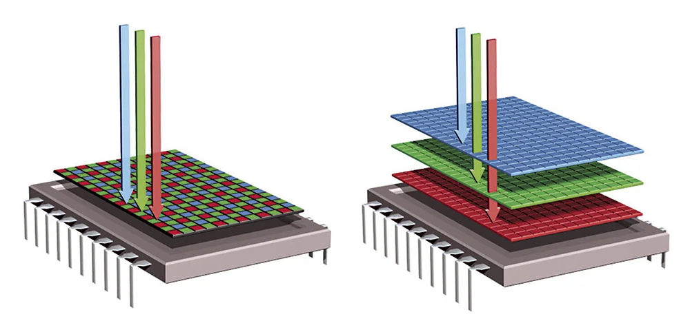
  
  Рисунок 3 &ndash; Принцип работы Foveon X3

**Преимущества:**

1. Изображение, которое даёт фотодатчик, более натуральное, т.к. отпадает необходимость в интерполяции.
2. Отсутствие цветового муара &ndash; артефакта, характерного для мозаичных матриц.
3. По заявлению разработчиков фотодатчик Foveon Х3 имеет ещё одно свойство &ndash; простой биннинг, изменяемый размер пикселя. Малый размер позволяет делать снимки высокого разрешения и качества. Больший &ndash; даёт возможность снимать при слабом освещении. При этом объединение сенсоров в пиксели может проводиться программно, без смены самой матрицы. Подобная технология изменения площади пикселя используется в матрицах компании Fujifilm.

  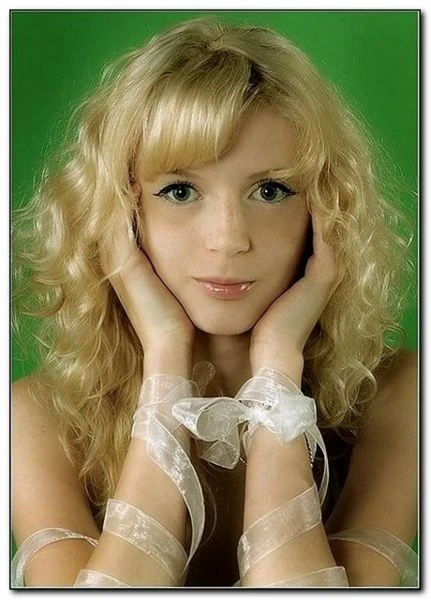
  
  Рисунок 4 &ndash; Пример изображения, снятого на Foveon X3

  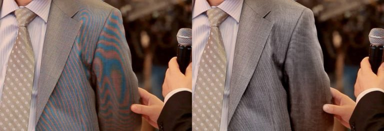
  
  Рисунок 5 &ndash; Пример цветового муара

**Недостатки:**

1. Относительно высокий уровень цифрового шума, что объясняется влиянием верхних слоёв кремния на красный и зелёный слои фотодиода. 

#### `Nikon RGB-матрица`

Цветоделение на аддитивные цвета $RGB$ производится дихроическими зеркалами внутри каждого пиксела, содержащего три фотодиода и одну микролинзу на весь пиксел.

  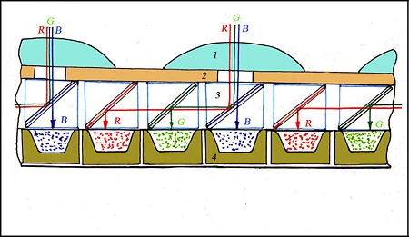
  
  Рисунок 6 &ndash; Принцип работы Nikon RGB-матрицы

**Преимущества:**

1. Отсутствие необходимости в дебайеризации, увеличение эффективного разрешения.

**Недостатки:**

1. Очевидная высокая сложность и неоднородность сенсора.

Теперь перейдем к самой распространненной технологии цветоделения &ndash; применение массивов цветных светочувствительных фильтров. И начнем с ее самого известного варианта &ndash; фильтра Байера.

### 4.2 Фильтр Байера

Фильтр Байера (шаблон Байера, паттерн Байера) &ndash; это двумерный массив цветных фильтров, которыми накрыты фотодиоды фотоматриц. Используется для получения цветного изображения в матрицах цифровых фотоаппаратов, видеокамер и сканеров. Фильтр Байера состоит из $25\%$ красных элементов, $25\%$ синих и $50\%$ зелёных элементов, расположенных как показано на рисунке.

  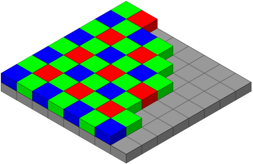
  
  Рисунок 7 &ndash; Фильтр Байера

Исторически это самый первый из массивов цветных фильтров. Назван по имени его создателя, доктора Брайса Э. Байера (англ. Bryce Bayer), сотрудника компании Kodak, запатентовавшего предложенный им фильтр в 1976 г. Для отличия от других разновидностей его называют $GRGB$, $RGBG$, или (если надо подчеркнуть диагональное расположение красного и синего пикселов) $RGGB$. Существуют различные вариации массивов.

  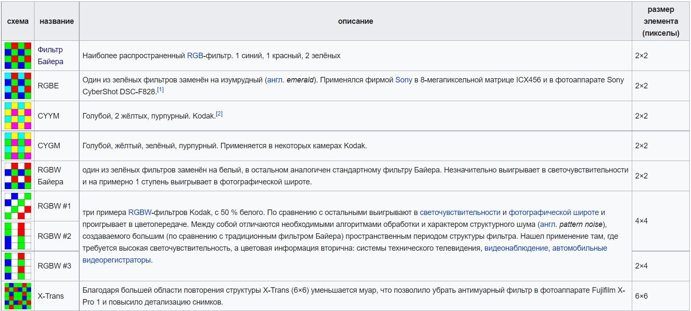
  
  Рисунок 8 &ndash; Варианты расположения элементов в массиве

**Преимущества:**

*Преимущества перед трёхматричными системами*:
1. Компактность.
2. Технологичность, возможность производства интегральной микросхемы со всей прилегающей к ней оптической частью (фильтр Байера, микролинзы, low-pass-фильтр) как единого целого.
3. Отсутствие проблем сведения цветов и механической юстировки. Возможность применения в зеркальных аппаратах.
4. Возможность применения объектива с малым задним вершинным расстоянием, что существенно уменьшает габариты камеры и упрощает оптическую схему при сохранении характеристик.

*В сравнении с многослойными сенсорами:*
1. Качество цветопередачи.  
   Цветопередача таких матриц в наибольшей степени определяется свойствами кремния как такового, и произвольный выбор красителя для фильтрации компонентов невозможен.  
   К сожалению, в многослойных матрицах разделение цветов оказывается далеко не полным. Часть фотонов поглощается в «чужой» области. В результате цветовая информация оказывается неполной, насыщенность цвета при прямом использовании сигналов $R$, $G$, $B$ с сенсора как значений пиксела изображения даёт малоконтрастную ненасыщенную картинку. Для компенсации этого эффекта требуется вводить агрессивный алгоритм восстановления цветового оттенка. Именно вынужденный подъём насыщенности вносит основной вклад в увеличение итогового шума матрицы.

*Сравнение с матрицами с внутрипиксельным цветоделением:*
1. Технологичность.

**Недостатки:**

1. Необходимость восстанавливать часть цветовой информации приводит к потере пространственного разрешения в цветных деталях.
2. Процедура восстановления порождает эффект цветного муара и цветные артефакты.
3. Для снижения эффекта цветного муара применяется фильтр нижних частот (low-pass), дополнительно размывающий изображение до его попадания на матрицу. Это приводит к дополнительному снижению разрешающей способности системы в целом и снижению микроконтраста.
4. Снижение резкости в алгоритме и на фильтре low-pass делает необходимым применение алгоритмов повышения резкости.

### 4.3 Получение многоспектральных и гиперспектральных изображений

Задача цветоделения при построении многоспектральных ($4+$ каналов) и гиперспектральных ($100+$ каналов) изображений принципиально не отличается от такой задачи при построении цветных изображений. Однако, количество каналов накладывает существенные ограничения на используемые подходы. Применение упомянутых выше подходов практически невозможно:
- разделение светового потока на несколько раздельных сенсоров;
- разделение регистрирующих плоскостей сенсора в пространстве;
- разделение цветового потока в каждом элементарном сенсоре и применение массивов цветных светочувствительных фильтров.

#### Разделение светового потока на несколько раздельных сенсоров

Разделить световой поток на разные сенсоры возможно только для действительно малого количества дополнительных каналов, например 4-6 каналов, из-за необходимости существенного увеличения габаритов камеры. Но и тут возникает дилемма: если каналы все внутри оптического диапазона, то малое их количество не позволяет применять алгоритмы спектрального анализа для решения многих задач, а если каналы выходят за оптический диапазон (например, захват ближнего или дальнего ИК-диапазона), требуется сенсор, работающий на других принципах. Плюс к этому разделение светового потока уменьшает количество попадающего на сенсор света.

Поэтому в случае малого количества различных каналов проще использовать несколько камер, объединенных в один корпус.

  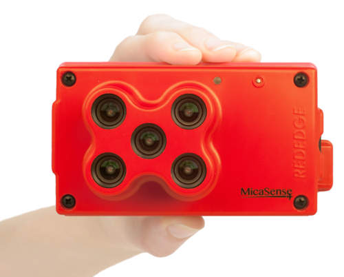
  
  Рисунок 9 &ndash; Пятиканальная камера для сельского хозяйства MicaSense RedEdge&trade;

Преимущество такого подхода в том, что камера может делать кадры высокого разрешения с необходимой сшивкой за $1$ секунду. Правда, задачи, решаемые довольно недешевой камерой (более $\$5500$) ограничиваются сельским хозяйством &ndash; расчет нескольких вегетативных индексов (например, $NDVI$).

Тем не менее на некоторых спутниках используются разделение света призмами и регистрация сразу всего кадра несколькими сенсорами.

#### Разделение регистрирующих плоскостей сенсора в пространстве

Использование большого количества слоев пока невозможно, потому что технология даже для 3х слоев пока еще совершенствуется. 

#### Разделение цветового потока в каждом элементарном сенсоре и применение массивов цветных светочувствительных фильтров

Получение полноразмерных кадров при увеличении регистрируемых интервалов спектра затрудняется необходимостью уместить на небольшой площади количество элементов, равное количеству регистрируемых слоев. При этом эффективное разрешение сильно падает.

#### Сканирование щелевыми спектрометрами

Этот способ на данный момент является наиболее популярным. 

  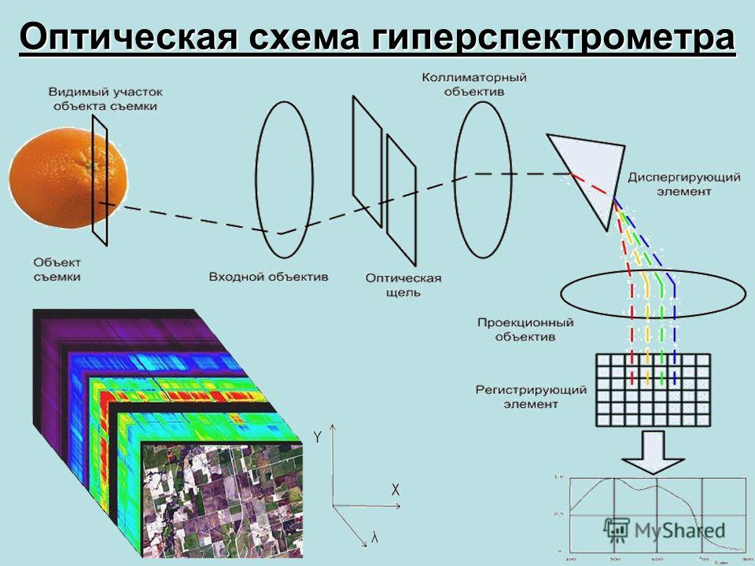
  
  Рисунок 10 &ndash; Принцип сканирующей гиперспектральной съемки

Часть изображения проецируется на щель (условно в $1$ пиксель). Эта полоска пикселей раскладывается призмой в спектр в направлении, перпендикулярном ориентации исходной полоски. Полученный кадр-разложение регистрируется целиком сенсором. Для съемки следующей полоски камера смещается (или объект смещается). Полученное изображение обрабатывается и собирается в гиперкуб &ndash; изображение с множеством слоев.

Из-за необходимости "сканировать" объект чаще всего применяется для дистанционного зондирования земли с самолетов или спутников.

### 4.4 Процесс дебайеризации (demosaicing)

Цель процесса дебайеризации &ndash; восстановление полноценного цветного изображения по данным об интенсивности цветов более низкой пространственной дискретизации. При этом алгоритмы должны отвечать следующим требованиям:

1. Минимизация вносимых цветовых артефактов на краях объектов

  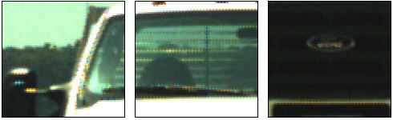

  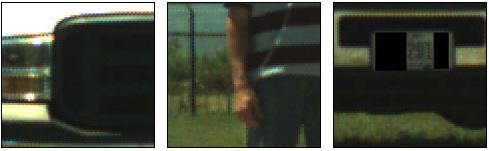

  
  

  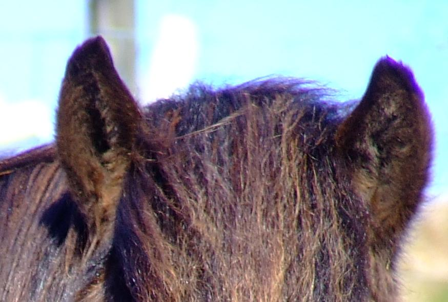
  
  Рисунок 11 &ndash; Артефакты

2. Максимальная передача исходного разрешения.
3. Низкая вычислительная сложность для применения в процессорах камер.
4. Возможность анализа и настройки для точного шумоподавления.

Существующие подходы к решению этой задачи следующие:
1. Суперпиксель (снижение разрешения).
2. Интерполяция: билинейная, бикубическая, сплайновая...
3. Корреляция пикселя с изображением: *Variable Number of Gradients*, *Pixel Grouping*, *Adaptive Homogeneity-Directed*, *Aliasing Minimization* и *Zipper Elimination* ...
4. Суперразрешение (**прорабатывается**).

#### Суперпиксель

Метод суперпикселя очень прост. Он принимает четыре пикселя массива (матрица $2 \times 2$) и использует их в качестве значений канала $RGB$ для одного пикселя результирующего изображения (усреднение двух значений зеленого). Пространственное разрешение результирующего изображения $RGB$ составляет одну четверть исходного изображения, имея половину его ширины и половину его высоты. Этот метод очень быстрый. Он практически не имеет артефактов и очень хорошо подходит для демозаики передискретизированных изображений (изображений, разрешение сенсора которых значительно превышает разрешение оптики).

  
  
  Рисунок 12 &ndash; Снижение разрешения

#### Билинейная интерполяция

Метод билинейной интерполяции сохраняет исходное разрешение изображения. Поскольку изображение содержит только один цветовой компонент на пиксель, этот метод вычисляет два недостающих компонента с помощью простой билинейной интерполяции из соседних пикселей. Этот метод работает очень быстро, но имеет тенденцию сглаживать острые края и создает цветовые артефакты вокруг краев. В целом, другие методы обычно дают лучшие результаты.

Поскольку метод работает с матрицей $3 \times 3$ пикселя, он не может напрямую восстанавливать цвета на границах изображения шириной в один пиксель. Текущая реализация копирует значения граничных пикселей из соседних пикселей.

  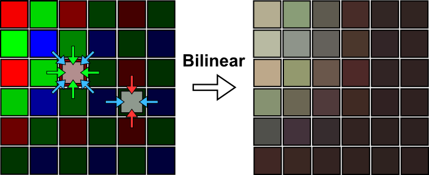
  
  Рисунок 13 &ndash; Билинейная интерполяция

#### Variable Number of Gradients

Метод $VNG$ означает переменное количество градиентов. Он работает с окрестностями $5 \times 5$ пикселей вокруг каждого исходного пикселя. Метод сначала вычисляет градиенты интенсивности в восьми направлениях вокруг текущего пикселя. Затем он вычисляет порог и принимает только градиенты ниже этого порога. На последнем шаге недостающие компоненты цвета для пикселя интерполируются из соседних пикселей по направлениям оставшихся градиентов. Этот метод сохраняет края намного лучше, чем билинейная интерполяция. Он также производит гораздо меньше цветовых артефактов и меньше цветного шума.

Поскольку метод работает с матрицей $5 \times 5$ пикселей, он не может напрямую восстанавливать цвета на границах изображения шириной $2$ пикселя. Текущая реализация копирует значения граничных пикселей из соседних пикселей.

  
  
  Рисунок 14 &ndash; Переменное количество градиентов

#### Pixel Grouping

В качестве домашнего задания прочитать статью [A. Lukin, D. Kubasov, An Improved Demosaicing Algorithm](http://audio.rightmark.org/lukin/pub/graphicon04demosaicing.pdf)

#### Adaptive Homogeneity-Directed

Есть гит, посвященный этому методу [Betterthinking/Homogeneity-Based-Demosaicing](https://github.com/Betterthinking/Homogeneity-Based-Demosaicing), но программы для матлаба. Есть исходные картинки.

Исходная статья: [Keigo Hirakawa, Adaptive Homogeneity-Directed Demosaicing Algorithm](https://citeseerx.ist.psu.edu/viewdoc/download?doi=10.1.1.59.1946&rep=rep1&type=pdf)

Обзорная публикация: [Thorsten Frommen, Adaptive Homogeneity-Directed Demosaicing Algorithm](https://www.researchgate.net/publication/228394656_Adaptive_Homogeneity-Directed_Demosaicing_Algorithm)