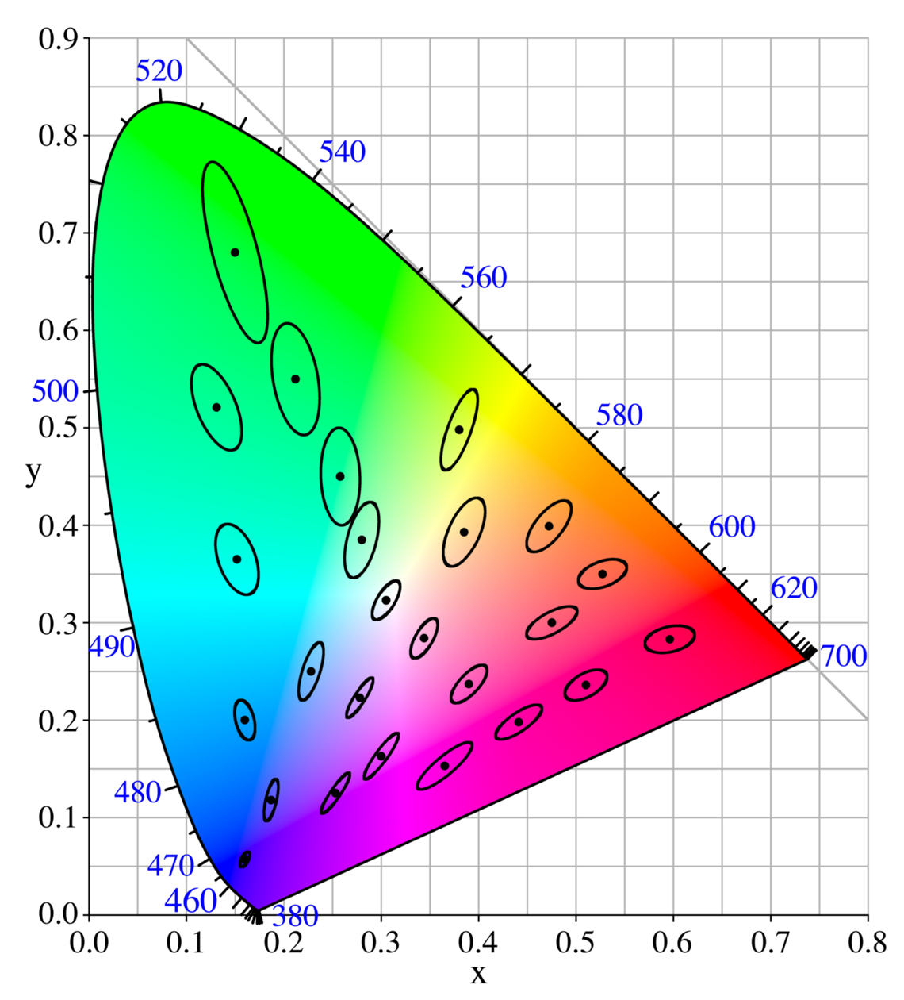

# Цифровая обработка изображений

© Бибиков С.А., к.т.н., доцент кафедры суперкомпьютеров и общей информатики, Самарский университет

## Лекция 5. Цветовые пространства. Переход между цветовыми пространствами

### Содержание:

1. [Определение цветового пространства](#51-определение-цветового-пространства)
2. [Цветовое пространство $XYZ$](#52-цветовое-пространство-xyz)
3. [Цветовой охват и диаграмма цветности](#53-цветовой-охват-и-диаграмма-цветности)
4. [Переход между цветовыми пространствами](#54-переход-между-цветовыми-пространствами)
5. [Семейство пространств RGB](#55-семейство-пространств-rgb)
6. [Цветовые пространства $HSL$ и $HSV$](#56-цветовые-пространства-hsl-и-hsv)
7. [Цветовое пространство $CMYK$](#57-цветовое-пространство-cmyk)
8. [Цветовое пространство $CIE$ $Lab$](#58-цветовое-пространство-cie-lab)
9. [Дельта Е](#59-дельта-е)
10. [Эллипсы МакАдама](#510-эллипсы-макадама)

### 5.1 Определение цветового пространства

Эксперименты $CIE$ по определению "Стандартного наблюдателя" привели к возможности поставить в соответствие цветовому ощущению от света произвольного спектрального состава три числовых значения. Грубо говоря, появилась возможность описать все цвета в некотором трехмерном (три компоненты) пространстве. Исторически работу над этой проблемой начал еще в 19 веке Грассман, создав свои законы смешивания цветов.

Цветовое пространство &ndash; это определенная организация цветов. В сочетании с цветовым профилированием, поддерживаемым различными физическими устройствами, оно поддерживает воспроизводимые (повторимые) представления цвета, будь то аналоговое или цифровое представление.

При этом есть цветовые пространства, заданные таблично (например шкала *Pantone*, где множеству цветов соответствуют числовые значения и иногда названия), есть пространства, заданные модельно (например $RGB$, в котором цвет определялся яркостью свечения люминофоров в цветной лучевой трубке согласно построенной абстрактной математической модели).

### 5.2 Цветовое пространство $XYZ$

В результате экспериментов $CIE$ было определено пространство $XYZ$. Осями координат в этом пространстве являются отклики "стандартного наблюдателя", соответствующие, но не совпадающие с длинноволновым $L$ (красный), средневолновым $M$ (зеленый) и коротковолновым $S$ (синий) рецепторами человеческого глаза. 

  
  
  
  Рисунок 1 &ndash; Представление пространства $LMS$

Точке пересечения осей соответствует черный. При этом при высокой яркости человек теряет способность различать цвет, и достаточно яркий зеленый все равно будет восприниматься как белый.

В модели $\textit{CIE 1931}$ $Y$ &ndash; это яркость, $Z$ квазиравно синему, а $X$ &ndash; это сочетание трех кривых $CIE$ $RGB$.

Координаты $XYZ$ и реальный спектр связаны достаточно сложно, в стандартном наблюдателе связь была определена только численно. Для модельной аппроксимации этой связи используются несколько функций.

$$
\begin{matrix*}[l]
  g(x;\mu, \sigma_1, \sigma_2) = 
  \begin{cases}
    \exp\left(-\displaystyle\frac{(x - \mu)^2}{2\sigma_1^2}\right), & x < \mu \\
    \exp\left(-\displaystyle\frac{(x - \mu)^2}{2\sigma_2^2}\right), & x \geq \mu \\
  \end{cases} \\\\
  \begin{align*}
    \overline{x}(\lambda) = &\quad 1.056 \cdot g(\lambda; 599.8, 37.9, 31.0) + 0.362 \cdot g(\lambda; 442.0, 16.0, 26.7) -\\
    &- 0.065 \cdot g(\lambda; 501.1, 20.4, 26.2)\\
    \overline{y}(\lambda) = &\quad 0.821 \cdot g(\lambda; 568.8, 46.9, 40.5) + 0.286 \cdot g(\lambda; 530.9, 16.3, 31.1) \\
    \overline{z}(\lambda) = &\quad 1.217 \cdot g(\lambda; 437.0, 11.8, 36.0) + 0.681 \cdot g(\lambda; 459.0, 26.0, 13.8)
  \end{align*}
\end{matrix*}
$$

Пространство $XYZ$ является самым старым цветовым пространством, оно и было выбрано в качестве промежуточного для всех возможных переходов и преобразований, универсальным пространством.

### 5.3 Цветовой охват и диаграмма цветности

Цветовое пространство $CIE$ $XYZ$ можно интерпретировать более удобным способом. Для этого используется пространство $xyY$, в котором параметр $Y$ является мерой общей светлости цвета (с этим термином очень много неясностей и различных синонимов и интерпретаций &ndash; яркость, светлота, объем). При этом цветность (красный или зеленый или фиолетовый или ...) определяется двумя производными параметрами $x$ и $y$. Для получения координат в пространстве $xyY$ значения определяются как функции трех трехцветных значений исходного пространства $X$, $Y$ и $Z$:

$$
\begin{align*}
  &x = \displaystyle\frac{X}{X + Y + Z} \\
  &y = \displaystyle\frac{Y}{X + Y + Z} \\
  &z = \displaystyle\frac{Z}{X + Y + Z} = 1 - x - y
\end{align*}
$$

Если принять $X + Y + Z = 1$, то мы фактически стоим срез исходного пространства $XYZ$, соответствующий фиксированной светлости цвета. Получаем $Y$ &ndash; значение по оси, перпендикулярной плоскости $xy$. Эта плоскость $xy$ называется *диаграммой цветности*.

  
  
  Рисунок 2 &ndash; Диаграмма цветности

Построенная диаграмма иногда называется "цветовой локус". По внешней криволинейной стороне расположены все чистые спектральные цвета, которые можно получить разложением белого цвета. Нижний прямолинейный отрезок соответствует смешанным цветам пурпура. Такого цвета в радуге не существует. Эта диаграмма содержит все воспринимаемые человеком цвета, однако их невозможно передать ни через монитор, ни через печать на бумаге. Современные средства цветовоспроизведения не могут пока обеспечить этого.

На этой диаграмме действуют и хорошо интерпретируются законы аддитивности Грассмана. Любые цвета, которые можно получить смешиванием двух исходных цветов, лежат на прямой, соединяющей исходные цвета. Смешивая три цвета, можно получить цвета, лежащие внутри треугольника с вершинами в исходных цветах.

Эту диаграмму часто используют для иллюстрации цветового охвата, то есть цветов, которые могут быть учтены или воспроизведены в определенном цветовом пространстве или на физическом устройстве.

  
  
  Рисунок 3 &ndash; Цветовой охват некоторых цветовых моделей

### 5.4 Переход между цветовыми пространствами

Многие созданные для решения технических задач цветовые пространства получаются из пространства $XYZ$ при помощи линейных преобразований. Это объясняется тем, что они в своей основе используют одинаковые законы физики, а именно линейную зависимость между мощностью сигнала и яркостью регистрируемого света. Это означает, что во многих случаях переход из одного цветового пространства в другое можно осуществить с использованием линейных преобразований в виде матрицы. При этом обычно используется несколько допущений или ограничений. Черный цвет, как полное отсутствие сигналов является общей точкой для всех таких цветовых пространств. Значит, преобразование смещения в матрице отсутствует. Остаются линейные преобразования поворота и масштабирования.

Матрица в данном случае будет иметь размерность $3 \times 3$. Операция преобразования цветов линейна, а значит теоретически полностью обратима. Однако, при использовании реальных числовых представлений координат цвета часть информации может теряться из-за недостаточной точности (например при сохранении 16 битного представления в 8 битное). Отсюда правило &ndash; проводить все работы с цветом в числах с плавающей точкой и сохранять в итоговое представление только готовый результат.

Пример матрицы преобразования из пространства $XYZ$ в пространство $RGB$ согласно [источнику](http://www.brucelindbloom.com/index.html?Eqn_RGB_XYZ_Matrix.html). Матрицы преобразования между пространствами $sRGB$ и $XYZ$:

$$
\begin{matrix*}[l]
  \begin{bmatrix}
    X_{D65} \\
    Y_{D65} \\
    Z_{D65}
  \end{bmatrix} =
  \begin{bmatrix*}[r]
    0.4124564 & 0.3575761 & 0.1804375 \\
    0.2126729 & 0.7151522 & 0.0721750 \\
    0.0193339 & 0.1191920 & 0.9503041
  \end{bmatrix*}
  \begin{bmatrix}
    R_{linear} \\
    G_{linear} \\
    B_{linear}
  \end{bmatrix}, \\
  C_{linear} = 
    \begin{cases}
      \displaystyle\frac{C_{sRGB}}{12.92}, & C_{sRGB} \leq 0.04045 \\
      \displaystyle\left(\frac{C_{sRGB} + 0.055}{1.055}\right)^\gamma, & C_{sRGB} > 0.04045
    \end{cases}, \quad \gamma = 2.4, C \in \{R, G, B\} \\\\
  \begin{bmatrix}
    R_{linear} \\
    G_{linear} \\
    B_{linear}
  \end{bmatrix} =
  \begin{bmatrix*}[r]
    3.2404542 & -1.5371385 & -0.4985314 \\
    -0.9692660 & 1.8760108 & 0.0415560 \\
    0.0556434 & -0.2040259 & 1.0572252
  \end{bmatrix*}
  \begin{bmatrix}
    X_{D65} \\
    Y_{D65} \\
    Z_{D65}
  \end{bmatrix}, \\
  C_{sRGB} = 
    \begin{cases}
      12.92 \cdot C_{linear}, & C_{linear} \leq 0.0031308 \\
      1.055 \cdot C_{linear}^{1/\gamma} - 0.055, & C_{linear} > 0.0031308
    \end{cases}, \quad \gamma = 2.4, C \in \{R, G, B\}
\end{matrix*}
$$

Для каждого цветового пространства определяются правила перевода цветов именно из/в $XYZ$, потому что $XYZ$ &ndash; универсальное цветовое пространство. При этом переход должен осуществляться из линеаризованного пространства, т.е. перед таким переходом из $RGB$ необходимо выполнить обратное гамма-преобразование.

Однако не все пространства являются линейными относительно $XYZ$. Например $CIE$ $Lab$ получается более сложными функциями, которые невозможно задать с помощью матрицы. Это определяется природой пространства. $CIE$ $Lab$ создавалось согласно другим принципам: пространство "моделирует" сигнал, приходящий в мозг в процессе зрения &ndash; разностный сигнал. Преобразование из $XYZ$ в $CIE$ $Lab$:

$$
\begin{matrix*}[l]
  L^* = 116 \cdot f(Y/Y_n) - 16 \\
  a^* = 500 \cdot \left(f(X/X_n) - f(Y/Y_n)\right) \\
  b^* = 200 \cdot \left(f(Y/Y_n) - f(Z/Z_n)\right) \\
  f(t) = 
    \begin{cases}
      \displaystyle\sqrt[3]{t}, & t > \delta^3 \\
      \displaystyle\frac{1}{3} t \delta^{-2} + \frac{4}{29} & t \leq \delta^3
    \end{cases}, \\
    \delta = \displaystyle\frac{6}{29} \\\\
  D65:
  \begin{bmatrix}
    X_{n} \\
    Y_{n} \\
    Z_{n}
  \end{bmatrix} =
  \begin{bmatrix*}[c]
    95.0489 \\
    100 \\
    108.8840
  \end{bmatrix*}
\end{matrix*}
$$

И обратное преобразование из $CIE$ $Lab$ в $XYZ$:

$$
\begin{matrix*}[l]
  X = X_n \cdot f^{-1}\left(\displaystyle\frac{L^* + 16}{116} + \displaystyle\frac{a^* }{500}\right) \\
  Y = Y_n \cdot f^{-1}\left(\displaystyle\frac{L^* + 16}{116}\right) \\
  Z = Z_n \cdot f^{-1}\left(\displaystyle\frac{L^* + 16}{116} - \displaystyle\frac{b^* }{200}\right) \\
  f^{-1}(t) = 
    \begin{cases}
      t^3, & t > \delta \\
      3 \delta^2 \left(t - \displaystyle\frac{4}{29}\right) & t \leq \delta
    \end{cases}, \\
    \delta = \displaystyle\frac{6}{29}
\end{matrix*}
$$

### 5.5 Семейство пространств $RGB$

Самым распространенным семейством цветовых пространств на данный момент является семейство $RGB$. В это семейство входят различные варианты цветовых пространств, основанных на одной модели и отличающихся деталями.

  
  
  Рисунок 4 &ndash; Цветовой охват некоторых $RGB$ пространств

На рисунке изображены охваты некоторых цветовых пространств. Можно заметить, что некоторые пространства даже выходят за пределы видимых человеком цветов. Это обусловлено необходимостью использовать законы Грассмана и желанием ограничиться только $3$ основными цветами, при этом охватить как можно больше отображаемых цветов для проведения корректных преобразований.

#### Принципы построения $RGB$

Здесь и далее подразумевается работа с линеаризованным представлением цвета, без применения гамма-преобразования, которое в обязательном порядке описано для $RGB$ пространств. Основные принципы всем достаточно хорошо известны. Осями для пространств $RGB$ являются яркости соответствующих элементов $R$, $G$, $B$. Эти яркости меняются от $0$ до $1$ и закодированы в соответствии с выбранным вариантом:
- если кодирование бинарное, мы получаем $3$ битное изображение &ndash; вспомните самые старые компьютерные игры, если видели такие;
- современным стандартом является кодирование каждого канала в $8$ бит, что дает $256$ градаций на канал;
- для повышения точности при проведении цифровой обработки или при использовании чувствительных сенсоров применяется кодирование $16$ бит на канал;
- существует несколько исторических вариантов, которые являются промежуточными для указанных.

Яркости этих каналов изначально подразумевали интенсивность свечения элементов в устройстве отображения (электронно-лучевой трубке). 

Пространство $RGB$ представляет собой куб. При смещении максимальных значений каждого канала мы получаем белый цвет, такие пространства называются аддитивными.

  
  
  Рисунок 5 &ndash; Цветовой куб $RGB$ пространства

Основным различием представителей семейства $RGB$ между собой являются координаты точек, являющихся вершинами этого куба, в пространстве $XYZ$ (а точнее на хроматической диаграмме $xy$). Эти же координаты определяют и цветовой охват получившегося пространства. Важной точкой является точка белого цвета с координатами $(1, 1, 1)$. Ее положение на хроматической диаграмме $xy$ тоже четко определено для каждого пространства и для каждого случая. Про точку белого мы поговорим на следующих занятиях.

#### Преобразование в $GrayScale$ из $RGB$

Часто возникает техническая необходимость убрать цветовую информацию из изображения, превратив его в изображение в градациях серого ($GrayScale$). Градации серого в нашем понимании представляют собой значения яркости. Чем выше интенсивность свечения точки, тем выше должно быть значение яркости. Наивный подход подсказывает, что можно просто сложить значения каждого из каналов для одной точки и нормировать полученную сумму. Однако это не даст желаемого результата. Это объясняется тем, что каналы отвечают за свет разных длин волн, а разные длины волн воспринимаются по-разному. Помимо этого существуют природные компенсаторные механизмы человеческого глаза.

  
  
  
  
  Рисунок 6 &ndash; Прямое усреднение каналов RGB и взвешенное усреднение

Веса для такого взвешенного усреднения следующие:
$$
Y_{linear} = 0.2126 \cdot R_{linear} + 0.7152 \cdot G_{linear} + 0.0722 \cdot B_{linear}
$$

Напомним, что речь идет о линейных значениях, без гамма коррекции. То есть процесс преобразования выглядит так:

1. Обратное гамма-преобразование исходного изображения.
2. Перевод в градации серого.
3. Прямое гамма-преобразование результирующего изображения.

Во многих цветовых пространствах для удобства использования интенсивность света (яркость, светлость и т.д.) выделены в отдельный канал. При этом два других канала отвечают за передачу цветности. При этом каналы, отвечающие за яркость, могут иметь немного отличный физический смысл, а коэффициенты отличаться от приведенных.

### 5.6 Цветовые пространства $HSL$ и $HSV$

Это скорее не само цветовое пространство, а способ описания цветов, т.е. цветовая модель.

$HSV$ (англ. $Hue, Saturation, Value$ &ndash; тон, насыщенность, значение) или $HSB$ (англ. $Hue, Saturation, Brightness$ &ndash; тон, насыщенность, яркость) &ndash; цветовая модель, в которой координатами цвета являются:
1. $Hue$ &ndash; цветовой тон, (например, красный, зелёный или сине-голубой). Варьируется в пределах $0$&ndash;$360\degree$, однако иногда приводится к диапазону $0$&ndash;$100$ или $0$&ndash;$1$.
2. $Saturation$ &ndash; насыщенность. Варьируется в пределах $0$&ndash;$100$ или $0$&ndash;$1$. Чем больше этот параметр, тем «чище» цвет, поэтому этот параметр иногда называют чистотой цвета. А чем ближе этот параметр к нулю, тем ближе цвет к нейтральному серому.
3. $Value$ &ndash; значение цвета или $Brightness$ &ndash; яркость. Также задаётся в пределах $0$&ndash;$100$ или $0$&ndash;$1$.

  
  
  
  Рисунок 7 &ndash; Цилиндрическое и конусообразное представление $HSV$ и $HSL$

#### Переход из $RGB$ в $HSV$

Довольно сложная в описании модель на деле рассчитывается достаточно быстро.

Пусть:

$$
\begin{align*}
  &H \in [0, 360],\\
  &S, V, R, G, B \in [0, 1], \\
  &MAX = max(R, G, B), \\
  &MIN = min(R, G, B).
\end{align*}
$$

Тогда:

$$
\begin{align*}
  &H = 
    \begin{cases}
      \text{не определено}, & \text{если } MAX = MIN \\
      60 \cdot \displaystyle\frac{G - B}{MAX - MIN} + 0, & \text{если } MAX = R \text{ и } G \geq B \\
      60 \cdot \displaystyle\frac{G - B}{MAX - MIN} + 360, & \text{если } MAX = R \text{ и } G < B \\
      60 \cdot \displaystyle\frac{B - R}{MAX - MIN} + 120, & \text{если } MAX = G \\
      60 \cdot \displaystyle\frac{R - G}{MAX - MIN} + 240, & \text{если } MAX = B
    \end{cases} \\
  &S = 
    \begin{cases}
      0, & \text{если } MAX = 0 \\
      1 - \displaystyle\frac{MIN}{MAX}, & \text{иначе}
    \end{cases} \\
  &V = MAX
\end{align*}
$$

Часто художники предпочитают использовать $HSV$ вместо других моделей, таких как $RGB$ и $CMYK$, потому что они считают, что устройство $HSV$ ближе к человеческому восприятию цветов. $RGB$ и $CMYK $определяют цвет как комбинацию основных цветов (красного, зелёного и синего или жёлтого, пурпурного, бирюзового и чёрного, соответственно), в то время как компоненты цвета в $HSV$ отображают информацию о цвете в более привычной человеку форме:
- Что это за цвет?
- Насколько он насыщенный?
- Насколько он светлый или тёмный?

Цветовое пространство $HSL$ представляет цвет похожим и даже, возможно, более интуитивно понятным образом, чем $HSV$.

$HSL$, $HSV$, $HSI$ или родственные модели часто используются в компьютерном зрении и анализе изображений для обнаружения признаков или сегментации изображений. Приложения таких инструментов включают:
- обнаружение объектов, например, в роботизированном зрении;
- распознавание объектов, например лиц, текста или номерных знаков;
- поиск изображений на основе контента;
- анализ медицинских изображений.

По большей части алгоритмы компьютерного зрения, используемые на цветных изображениях, являются прямыми расширениями алгоритмов, разработанных для изображений в градациях серого, например, $k$-средние, или нечеткая кластеризация цветов пикселей, или хитрое обнаружение краев. В самом простом случае каждый цветовой компонент отдельно проходит по одному и тому же алгоритму. Поэтому важно, чтобы интересующие особенности можно было различить в используемых цветовых измерениях. Поскольку компоненты $R$, $G$ и $B$ цвета объекта в цифровом изображении коррелируют с количеством света, падающего на объект, и, следовательно, друг с другом, описание изображения с точки зрения этих компонентов затрудняет различение объектов. Описания в терминах оттенок/яркость/цветность или оттенок/яркость/насыщенность часто более уместны.

Начиная с конца 1970-х годов такие преобразования, как $HSV$ или $HSI$, использовались как компромисс между эффективностью сегментации и вычислительной сложностью.

### 5.7 Цветовое пространство $CMYK$

Цветовая модель $CMYK$ (также известная как триадный цвет или четырехцветная модель) представляет собой ***субтрактивную*** цветовую модель, основанную на цветовой модели $CMY$, используемую в цветной печати, а также для описания самого процесса печати. $CMYK$ относится к четырем красочным пластинам, используемым в некоторых видах цветной печати: голубому, пурпурному, желтому и ключевому (черному). Зачем нужен черный цвет? Проблема в том, что смешивая три исходных цвета с максимальным покрытием, мы получим темно-грязно-коричневый, и стоимость такого цвета будет очень высокой.

  
  
  Рисунок 8 &ndash; Модель $CMY$

Современные печатные процессы могут использовать гораздо большее количество красок, поэтому теоретическое описание всех вариантов цветопредставления при печати не имеет особого смысла. Ограничились четырьмя цветами. В описании указывается даже тип бумаги, на которой происходит печать. Каждый конкретный процесс печати требует тонкой настройки, чтобы обеспечить воспроизводимость.

### 5.8 Цветовое пространство $CIE$ $Lab$

$LAB$ &ndash; аббревиатура названия двух разных (хотя и похожих) цветовых пространств. Более известным и распространенным является $CIELAB$ (точнее, $\textit{CIE 1976 } L^*a^*b^*$), другим &ndash; $\textit{Hunter Lab}$ (точнее, $\textit{Hunter L, a, b}$). Таким образом, $Lab$ &ndash; это неформальная аббревиатура, не определяющая цветовое пространство однозначно. Чаще всего, говоря о пространстве $Lab$, подразумевают $CIELAB$.

При разработке $Lab$ преследовалась цель создания цветового пространства, изменение цвета в котором будет более линейным с точки зрения человеческого восприятия (по сравнению с $XYZ$), то есть с тем, чтобы одинаковое изменение значений координат цвета в разных областях цветового пространства производило одинаковое ощущение изменения цвета. Таким образом математически корректировалась бы нелинейность восприятия цвета человеком.

  
  
  Рисунок 9 &ndash; Пространство $CIE$ $Lab$

ПО всем правилам $CIE$ $Lab$ это полноценное цветовое пространство, соответствующее стандартному наблюдателю. Преобразование координат цветов из $XYZ$ в $CIE$ $Lab$ является нелинейным и достаточно медленным.

Преобразование из $XYZ$ в $CIE$ $Lab$:

$$
\begin{matrix*}[l]
  L^* = 116 \cdot f(Y/Y_n) - 16 \\
  a^* = 500 \cdot \left(f(X/X_n) - f(Y/Y_n)\right) \\
  b^* = 200 \cdot \left(f(Y/Y_n) - f(Z/Z_n)\right) \\
  f(t) = 
    \begin{cases}
      \displaystyle\sqrt[3]{t}, & t > \delta^3 \\
      \displaystyle\frac{1}{3} t \delta^{-2} + \frac{4}{29} & t \leq \delta^3
    \end{cases}, \\
    \delta = \displaystyle\frac{6}{29} \\\\
  D65:
  \begin{bmatrix}
    X_{n} \\
    Y_{n} \\
    Z_{n}
  \end{bmatrix} =
  \begin{bmatrix*}[c]
    95.0489 \\
    100 \\
    108.8840
  \end{bmatrix*}
\end{matrix*}
$$

И обратное преобразование из $CIE$ $Lab$ в $XYZ$:

$$
\begin{matrix*}[l]
  X = X_n \cdot f^{-1}\left(\displaystyle\frac{L^* + 16}{116} + \frac{a^* }{500}\right) \\
  Y = Y_n \cdot f^{-1}\left(\displaystyle\frac{L^* + 16}{116}\right) \\
  Z = Z_n \cdot f^{-1}\left(\displaystyle\frac{L^* + 16}{116} - \frac{b^* }{200}\right) \\
  f^{-1}(t) = 
    \begin{cases}
      t^3, & t > \delta \\
      3 \delta^2 \left(t - \displaystyle\frac{4}{29}\right) & t \leq \delta
    \end{cases}, \\
    \delta = \displaystyle\frac{6}{29} \\\\
\end{matrix*}
$$

В отличие от цветовых пространств $RGB$ или $CMYK$, которые являются, по сути, набором аппаратных данных для воспроизведения цвета на бумаге или на экране монитора (цвет может зависеть от типа печатной машины, марки красок, влажности воздуха в цеху или производителя монитора и его настроек), $Lab$ однозначно определяет цвет. Поэтому $Lab$ нашёл широкое применение в программном обеспечении для обработки изображений в качестве промежуточного цветового пространства, через которое происходит конвертирование данных между другими цветовыми пространствами (например, из $RGB$ сканера в $CMYK$ печатного процесса). При этом особые свойства $Lab$ сделали редактирование в этом пространстве мощным инструментом цветокоррекции.

Благодаря характеру определения цвета в $Lab$ появляется возможность отдельно воздействовать на яркость, контраст изображения и на его цвет. Во многих случаях это позволяет ускорить обработку изображений, например, при допечатной подготовке. $Lab$ предоставляет возможность избирательного воздействия на отдельные цвета в изображении, усиления цветового контраста, незаменимыми являются и возможности, которые это цветовое пространство предоставляет для борьбы с шумом на цифровых фотографиях.

### 5.9 Дельта Е

Основным преимуществом пространства является перцептуальная линейность. То есть если расстояние между двумя точками в пространстве увеличивается в два раза, то и ощущаемая человеком разница между соответствующими цветами тоже вырастет вдвое.

Именно поэтому одним из стандартных способов спрогнозировать или оценить ощущаемую человеком цветовую разность между двумя цветами является использование $CIE$ $Lab$ и специально рассчитываемой величины цветовой разности. Изначально, при создании $CIE$ $Lab$, для определения цветовой разницы использовалось простое евклидово расстояние в пространстве:

$$
\Delta E_{ab}^* = \sqrt{\left(L_2^* - L_1^* \right)^2 + \left(a_2^* - a_1^* \right)^2 + \left(b_2^* - b_1^* \right)^2}
$$

$\Delta E_{ab}^* \approx 2.3$ примерно соответствует минимально различимому для человеческого глаза отличию между цветами.

С момента представления этого инструмента в 1976 году способ оценивания претерпел пару уточняющих редакций. $\Delta E$ редакции 1994 года (задавалось в цветовом пространстве $LCH$ ($L^*C^*h^*$):

$$
\Delta E_{94}^* = \sqrt{\left(\displaystyle\frac{L_2^* - L_1^* }{K_L}\right)^2 + \left(\displaystyle\frac{C_2^* - C_1^* }{1 + K_1C_1^* }\right)^2 + \left(\displaystyle\frac{h_2^* - h_1^* }{1 + K_2C_1^* }\right)^2}
$$

где весовой коэффициент $K$ зависит от области применения:
|     |Искусство|Промышленность|
|:---:|:-------:|:------------:|
|$K_L$|$1$      |$2$           |
|$K_1$|$0.045$  |$0.048$       |
|$K_2$|$0.015$  |$0.014$       |

Действующая сейчас величина называется $\textit{CIEDE2000}$. Ее описание слишком сложно и нагружено чтобы держать его в голове. Там добавилось 7 корректирующих добавок в простую формулу. Это обусловлено недостаточно точным соответствием пространства процессу восприятия. Работы над совершенствованием теории цвета постоянно продолжаются.

Ввиду того, что определение 1994 года не полностью устранило неоднородности восприятия цветового различия, комитет $CIE$ разработал новый стандарт, которые включал пять дополнений:
- поворот цветового угла тона $R_T$, чтобы устранить проблемы в синей области (угол $Hue$ $275\degree$);
- компенсация для нейтральных цветов;
- компенсация для светлоты $S_L$;
- компенсация для насыщенности цвета $S_C$;
- компенсация для тона $S_H$.

$$
\begin{matrix*}[l]
  \Delta E_{00}^* = \sqrt{\left(\displaystyle\frac{\Delta L'}{S_L}\right)^2 + \left(\displaystyle\frac{\Delta C'}{S_C}\right)^2 + \left(\displaystyle\frac{\Delta H'}{S_H}\right)^2 + R_T\displaystyle\frac{\Delta C'}{S_C}\frac{\Delta H'}{S_H}} \\
  \overline L = \displaystyle\frac{L_1^* + L_2^* }{2} \\
  \overline C = \displaystyle\frac{C_1^* + C_2^* }{2} \\
  a_1' = a_1 + \displaystyle\frac{a_1}{2}\left(1 - \displaystyle\frac{1}{2}\sqrt{\displaystyle\frac{\overline C^7}{\overline C^7 + 25^7}}\right) \\
  a_2' = a_2 + \displaystyle\frac{a_2}{2}\left(1 - \displaystyle\frac{1}{2}\sqrt{\displaystyle\frac{\overline C^7}{\overline C^7 + 25^7}}\right) \\
  b_1' = b_1 + \displaystyle\frac{b_1}{2}\left(1 - \displaystyle\frac{1}{2}\sqrt{\displaystyle\frac{\overline C^7}{\overline C^7 + 25^7}}\right) \\
  b_2' = b_2 + \displaystyle\frac{b_2}{2}\left(1 - \displaystyle\frac{1}{2}\sqrt{\displaystyle\frac{\overline C^7}{\overline C^7 + 25^7}}\right) \\
  C_1' = \sqrt{a_1'^2 + b_1'^2} \\
  C_2' = \sqrt{a_2'^2 + b_2'^2} \\
  \overline C = \displaystyle\frac{C_1' + C_2'}{2} \\
  \Delta C' = C_1' - C_2' \\
  h_1' = \arctan\left(\displaystyle\frac{b_1}{a_1'}\right) \bmod 2\pi \\
  h_2' = \arctan\left(\displaystyle\frac{b_2}{a_2'}\right) \bmod 2\pi \\
  \Delta h' = 
    \begin{cases}
      h_2' - h_1' & |h_1' - h_2'| \leq \pi \\
      h_2' - h_1' + 2\pi & |h_1' - h_2'| > \pi, h_2' \leq h_1' \\
      h_2' - h_1' - 2\pi & |h_1' - h_2'| > \pi, h_2' > h_1'
    \end{cases} \\
  \Delta H' = 2 \sqrt{C_1'C_2'\sin\left(\displaystyle\frac{\Delta h'}{2}\right)} \\
  \overline H' = 
    \begin{cases}
      \displaystyle\frac{\left(h_1' + h_2' + 2\pi\right)}{2} & |h_1' - h_2'| > \pi \\
      \displaystyle\frac{\left(h_1' + h_2'\right)}{2} & |h_1' - h_2'| \leq \pi \\
    \end{cases} \\
  T = 1 - 0.17 \cos\left(\overline H' - \displaystyle\frac{\pi}{6}\right) + 0.24 \cos\left(2\overline H'\right) + 0.32 \cos\left(3\overline H' + \displaystyle\frac{\pi}{30}\right) - 0.2 \cos\left(4\overline H' - \displaystyle\frac{7\pi}{20}\right) \\
  S_L = 1 + \displaystyle\frac{0.015\left(\overline L - 50\right)^2}{\sqrt{20 + \left(\overline L - 50\right)^2}} \\
  S_C = 1 + 0.045\overline C' \\
  S_H = 1 + 0.15\overline C'T \\
  R_T = -2 \sqrt{\displaystyle\frac{\overline C'^7}{\overline C'^7 + 25^7}} \sin \left[\displaystyle\frac{\pi}{6} \exp \left(-\displaystyle\frac{\overline H' - 55 \displaystyle\frac{\pi}{36}}{\displaystyle\frac{5\pi}{36}}\right)^2\right]
\end{matrix*}
$$

### 5.10 Эллипсы МакАдама

Одним из представлений цветовой информации о пространствах и способах оценки являются эллипсы МакАдама. При изучении цветового зрения эллипс МакАдама представляет собой область на диаграмме цветности, которая содержит все цвета, неотличимые для среднего человеческого глаза от цвета в центре эллипса. Таким образом, контур эллипса представляет едва заметные различия цветности.

  
  
  Рисунок 10 &ndash; Эллипсы МакАдама

Предполагалось, что в пространстве $CIE$ $Lab$ эллипсы МакАдама должны превратиться в идеальные окружности.