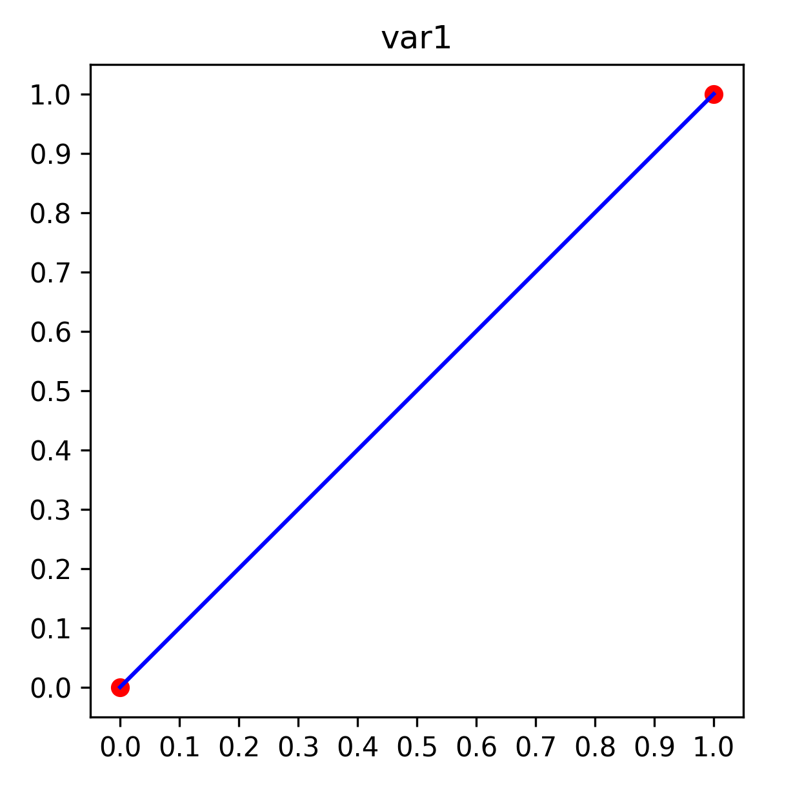
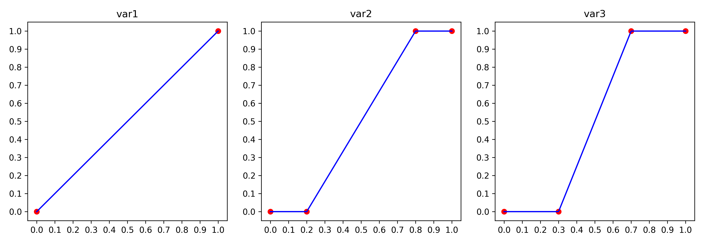
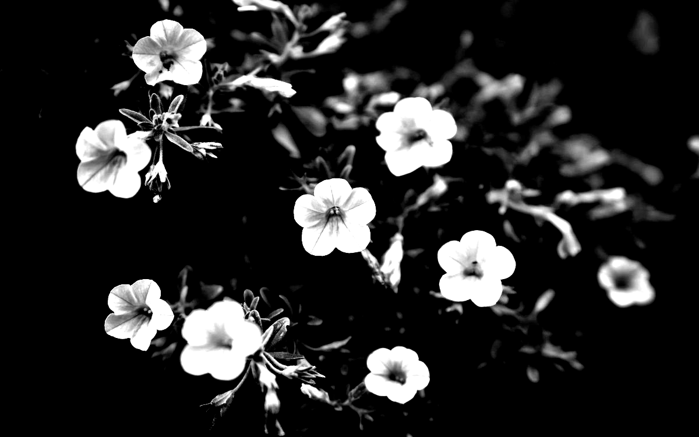

# Цифровая обработка изображений

© Бибиков С.А., к.т.н., доцент кафедры суперкомпьютеров и общей информатики, Самарский университет

## Лекция 7. Контрастирование. Преобразования яркости

Содержание:
1. [История преобразования яркости](#71-история-преобразования-яркости)

### 7.1 История преобразования яркости

Идея преобразования яркости появилась с появлением фотографии. С помощью регуляции времени проявки можно было попытаться исправить ошибки при выборе времени экспозиции в ранней фотографии. Слишком темные фото, снятые при недостаточной экспозиции, можно было сделать светлее, светлые темнее. Качество детализации конечно страдало, но общее впечатление от изображение могло улучшаться. Позже, с усовершенствованием процессов и химии съемки и проявки фотоизображений, стала доступна операция, которую называют *препарированием*. С появлением телевидения появилась необходимость настраивать получаемые по радиосвязи изображения под конкретный приемник. По аналогии с громкостью на радио, одними из основных настраиваемых характеристик изображения стали яркость и контрастность (хотя тут справедливее использовать термин ***динамический диапазон***) изображения.

В ЭЛТ за яркость отвечало напряжение, разгоняющее электроны на пути к люминесцентному слою экрана. Повышение напряжения приводило к увеличению энергии электрона и, соответственно, к большей светимости люминофора на экране. Динамический диапазон (или применительно к эпохе аналогового ТВ контрастность) &ndash; отношение яркости самой яркой точки (той, что считается белой) к самой тусклой (той, что считается черной). В более продвинутые времена применялись специальные каскады, обрабатывающие приходящий сигнал.

Сейчас в цифровой технике применяются те же аналоги каскадов, только в цифровом варианте. Частично с таким типом преобразований вы уже сталкивались при изучении гамма-коррекции. Рассмотрим некоторую корректирующую функцию $f$, которая работает только с каналом яркости $L$ на изображении (или по аналогии с телевидением будем рассматривать картинку в градациях серого).

$$
L = f(L)
$$

Если предположить, что эта функция не вносит никаких изменений, то есть входное значение, например $L=0.5$, соответствует выходному значению $f(0.5) = 0.5$, то ее график будет выглядеть так:

  
  
  Рисунок 1 &ndash; Функция неизменной яркости

Это базовая функция, которой удобно сравнивать и относительно которой удобно оценивать поведение других функций.

### 7.2 Контраст и преобразование яркости

Локальный контраст это разница между яркостями различных предметов на изображении. Отсюда довольно простая идея: чем круче линия преобразования яркости на каком то промежутке, тем выше будет контраст после преобразования. Объясняется довольно просто на примере: допустим у нас значение яркости фона равно $70$, а яркости объекта $150$. Разница $80$. 

  
  
  Рисунок 2 &ndash; Набор преобразований

Данные преобразования приводят к увеличению разницы яркостей всех точек изображенияю. Следует обратить внимание, что в результате использования таких изображений часть точек стала полностью черной, хотя до этого у них были значения отлчиные от $0$. Эти точки обладали значениями яркости, соответвующими горизонтальным участкам графика преобразования. То же самое относится и к достаточно ярким точкам, которые стали белыми. Мы фактически принесли в жертву часть диапазона яркостей, удалив оттуда информацию. Эта часть диапазона была использована для увеличения разницы между оставшимися яркостями, что привело к повышению контраста.

  
  
  
  
  Рисунок 3 &ndash; Результаты преобразований

Если мы используем преобразования яркости, показанное на рисунке 2, то значение яркости фона станет равным 20, а объекта...
