# Цифровая обработка изображений

© Бибиков С.А., к.т.н., доцент кафедры суперкомпьютеров и общей информатики, Самарский университет

© Петров М.В., старший преподаватель кафедры суперкомпьютеров и общей информатики, Самарский университет

## Лекция 7. Контрастирование. Преобразования яркости

Содержание:
1. [История преобразования яркости](#71-история-преобразования-яркости)
2. [Контраст и преобразование яркости](#72-контраст-и-преобразование-яркости)
3. [Препарирование изображений](#73-препарирование-изображений)
4. [Нелинейные функции изменения яркости](#74-нелинейные-функции-изменения-яркости)
5. [Поканальное изменение яркости](#75-поканальное-изменение-яркости)
6. [Идентификация параметров функции преобразования](#76-идентификация-параметров-функции-преобразования)

### 7.1 История преобразования яркости

Идея преобразования яркости появилась с появлением фотографии. С помощью регуляции времени проявки можно было попытаться исправить ошибки при выборе времени экспозиции в ранней фотографии. Слишком темные фото, снятые при недостаточной экспозиции, можно было сделать светлее, светлые темнее. Качество детализации конечно страдало, но общее впечатление от изображение могло улучшаться. Позже, с усовершенствованием процессов и химии съемки и проявки фотоизображений, стала доступна операция, которую называют *препарированием*. С появлением телевидения появилась необходимость настраивать получаемые по радиосвязи изображения под конкретный приемник. По аналогии с громкостью на радио, одними из основных настраиваемых характеристик изображения стали яркость и контрастность (хотя тут справедливее использовать термин ***динамический диапазон***) изображения.

В ЭЛТ за яркость отвечало напряжение, разгоняющее электроны на пути к люминесцентному слою экрана. Повышение напряжения приводило к увеличению энергии электрона и, соответственно, к большей светимости люминофора на экране. Динамический диапазон (или применительно к эпохе аналогового ТВ контрастность) &ndash; отношение яркости самой яркой точки (той, что считается белой) к самой тусклой (той, что считается черной). В более продвинутые времена применялись специальные каскады, обрабатывающие приходящий сигнал.

Сейчас в цифровой технике применяются те же аналоги каскадов, только в цифровом варианте. Частично с таким типом преобразований вы уже сталкивались при изучении гамма-коррекции. Рассмотрим некоторую корректирующую функцию $f$, которая работает только с каналом яркости $L$ на изображении (или по аналогии с телевидением будем рассматривать картинку в градациях серого).

$$
L = f(L)
$$

Если предположить, что эта функция не вносит никаких изменений, то есть входное значение, например $L=0.5$, соответствует выходному значению $f(0.5) = 0.5$, то ее график будет выглядеть так:

  
  
  Рисунок 1 &ndash; Функция неизменной яркости

Это базовая функция, которой удобно сравнивать и относительно которой удобно оценивать поведение других функций.

### 7.2 Контраст и преобразование яркости

Локальный контраст это разница между яркостями различных предметов на изображении. Отсюда довольно простая идея: чем круче линия преобразования яркости на каком то промежутке, тем выше будет контраст после преобразования. Объясняется довольно просто на примере: допустим у нас значение яркости фона равно $70$, а яркости объекта $150$. Разница $80$. 

  
  
  Рисунок 2 &ndash; Набор преобразований повышения контрастности

Данные преобразования приводят к увеличению разницы яркостей всех точек изображенияю. Следует обратить внимание, что в результате использования таких изображений часть точек стала полностью черной, хотя до этого у них были значения отлчиные от $0$. Эти точки обладали значениями яркости, соответвующими горизонтальным участкам графика преобразования. То же самое относится и к достаточно ярким точкам, которые стали белыми. Мы фактически принесли в жертву часть диапазона яркостей, удалив оттуда информацию. Эта часть диапазона была использована для увеличения разницы между оставшимися яркостями, что привело к повышению контраста.

  
  
  
  
  Рисунок 3 &ndash; Результаты преобразований повышения контрастности

Справедлива и обратная операция - уменьшение контраста. По указанной выше логике, чем более пологой является линия преобразования, тем меньше будет контраст после преобразования. Нужно отметить, что уменьшение контраста влечет за собой только равномерную потерю информации во всем изображении. При этом полезного наглядного эффекта нет. Такая операция оправдана только в художественных целях.

  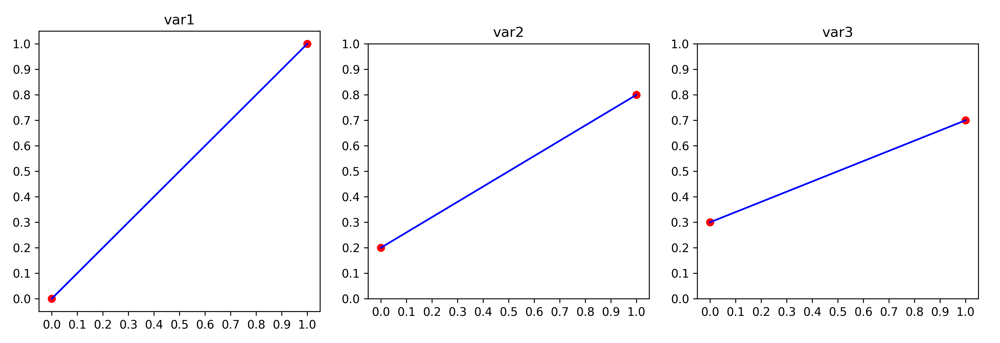
  
  Рисунок 4 &ndash; Набор преобразований понижения контрастности

  
  
  
  
  Рисунок 5 &ndash; Результаты преобразований понижения контрастности

Важным является понимание того, что если функция преобразования контраста $L_1$ является обратной к функции $L_2$, т.е. $L_1 = L_2^{-1}$, то применение $L_2$ к результату преобразования $L_1$ теоретически должно возвращать изображение в исходное состояние. Однако так происходит не всегда. Если мы будем сохранять промежуточный вариант, используя целые значения из заданного диапазона, то мы потеряем часть информации о яркости. Поэтому все промежуточные операции с изображениями стоит проводить в максимально доступной точности. Приведенные выше примеры преобразований на повышение и понижение контраста являются соответственно обратными друг другу. Но давайте посмотрим, что произойдет, если мы последовательно применим "обратные" друг другу операции.

  
  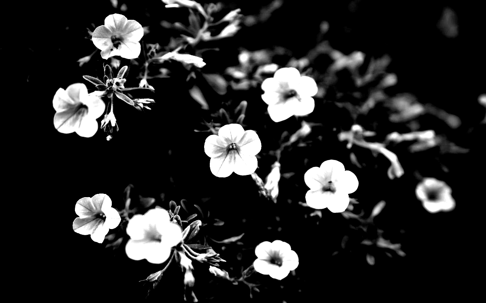
  
  
  Рисунок 6 &ndash; Результаты применения обратных преобразований контрастности

Потери информации о яркости были сохранены в промежуточный результат. Это привело к тому, что исходное изображение мы не получили.

### 7.3 Препарирование изображений

Преобразования яркости, не смотря на максимально простую реализацию, являются довольно мощным инструментом предварительной обработки изображений. Приведем несколько примеров различных преобразований на рисунке 7.

  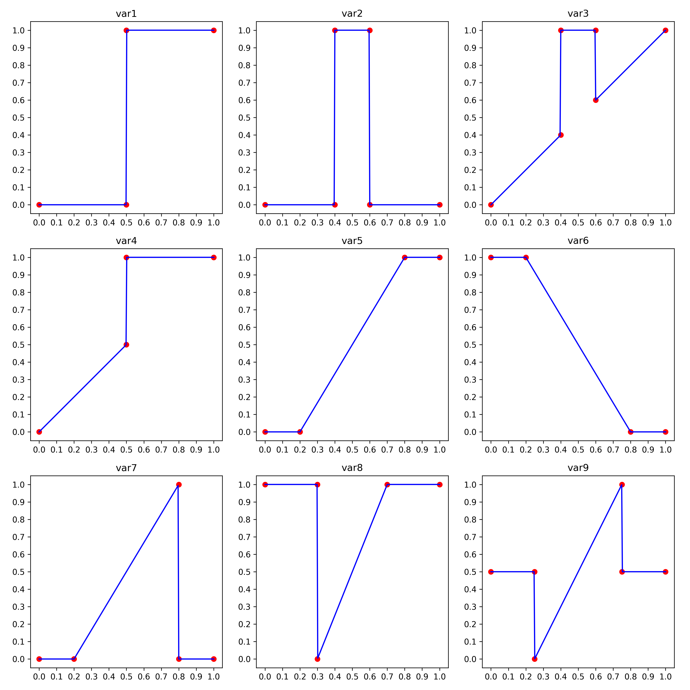
  
  Рисунок 7 &ndash; Набор преобразований

Первое преобразование является пороговым фильтром. Все точки с яркостью выше порога становятся белыми, ниже порога черными. Пороговую обработку можно рассматривать как логический фильтр с условием $L>T$, где $T$ - величина порога, в данном конкретном случае $T = 0.5$. Так же можно рассматривать пороговую фильтрацию как экстремальный случай контрастирования изображения. Часто пороговую фильтрацию используют для разделения объекта и фона. Результат пороговой фильтрации приведен на рисунке 8.

  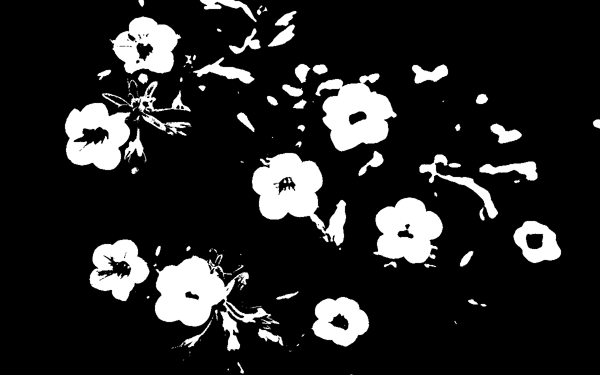
  
  Рисунок 8 &ndash; Результат пороговой фильтрации

Следующий пример соответствует логическому фильтру с условием $(L > T_{1}) AND (L < T_{2})$. Такая обработка пригодится для выделения объектов, обладающих яркостью из определенного диапазона. Результат такого преобразования показан на рисунке 9. Обратите внимание, что из-за особенностей раскраски растения при должном выборе порогов появится возможность получить практически замкнутые контуры цветов, что позволит проводить дальнейшую, возможно более сложную, обработку изображения.

  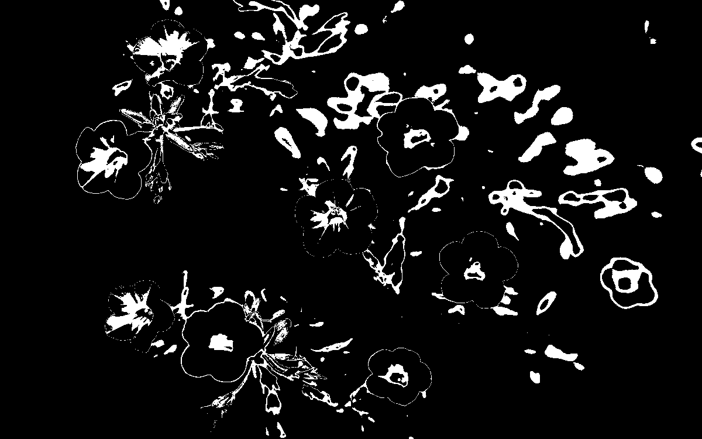
  
  Рисунок 9 &ndash; Результат фильтрации с двумя условиями

Следующий пример объединяет предыдущий фильтр и исходное изображение. Такое преобразование может быть полезным для фокусировке внимания на нужных объектах при работе человека непосредственно с изображением. Нужно понимать, что такой фильтр будет работать довольно странно, если у вам очень много ярких объектов на изображении.

  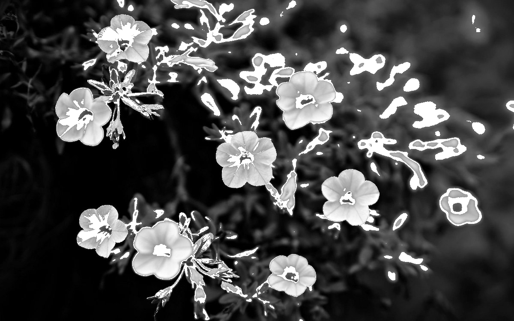
  
  Рисунок 10 &ndash; Результат фильтрации с двумя условиями + исходное изображение

Результат применения четвертого преобразования из набора является частным случаем предыдущих преобразования. Его можно интерпретировать как "пороговую обработку + исходное изображение".

  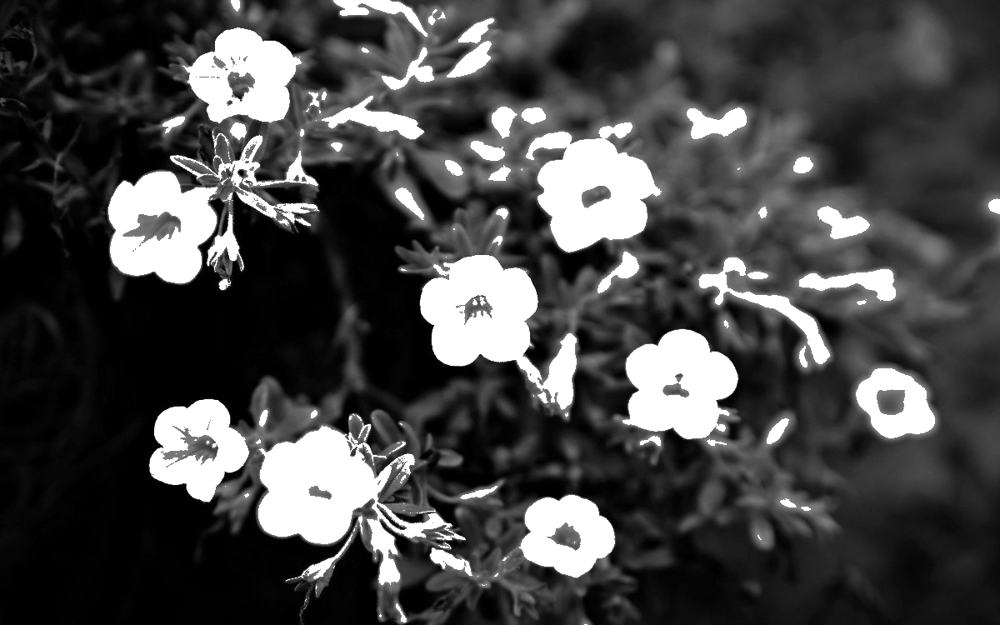
  
  Рисунок 11 &ndash; Результат пороговой обработки + исходное изображение

Со следующим преобразованием мы уже знакомились, это повышение контраста. За счет отказа от информации в темных и светлых оттенках исходного изображения, мы получаем возможность повысить различимость деталей (увеличить их относительный контраст) в области средней яркости.

  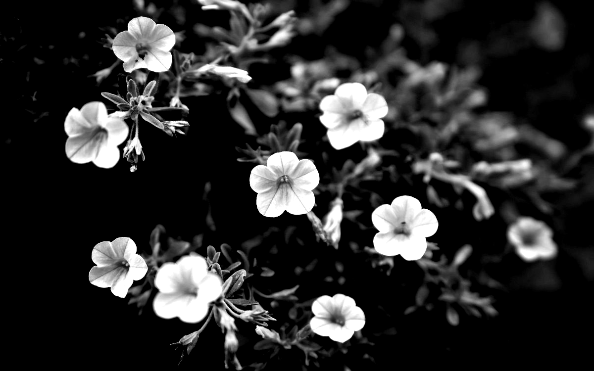
  
  Рисунок 12 &ndash; Результат повышения контраста

Интересный пример, про который мы не говорили изначально - инвертирование яркости - белый преобразуется в черный, черный в белый. На данном примере проводиться дополнительное контрастирование изображения. Данное преобразование применяется например для облегчения восприятия изображения конкретным пользователем. Например при использовании тепловизоров, бывает удобно самый горячий объект сцены отображать черным цветом.

  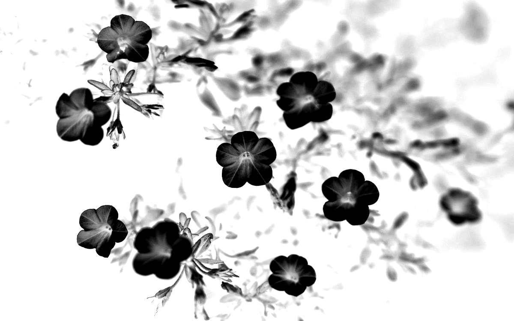
  
  Рисунок 13 &ndash; Результат повышения контраста с инвертированием яроксти

На рисунках 14-16 представлены примеры того, как влияет фон на восприятие изображения. Само преобразование представляет из себя контраститрование. Кроме него не попавшие в область интереса значения яркости приравниваются к черному, белому и серому цвету соответственно. Даже когда речь не идет о работе с цветом нейтральный серый является наиболее предпочтительным цветом фона для корректной оценки оттенков.

  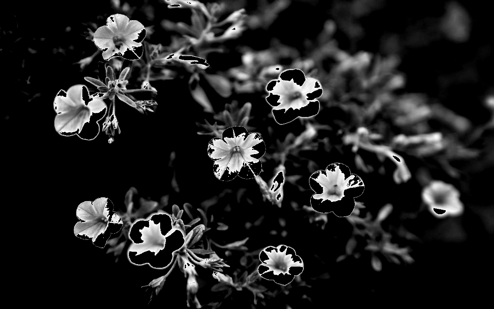
  
  Рисунок 14 &ndash; Контрастирование и черный фон

  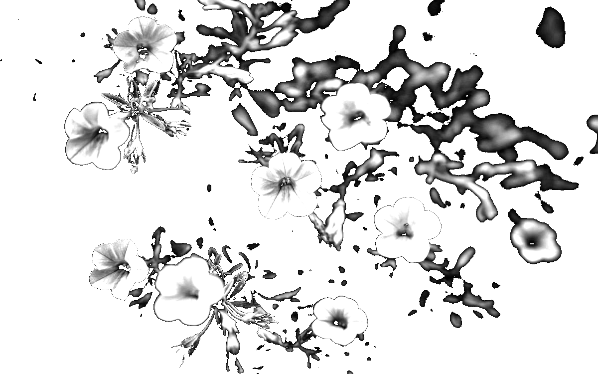
  
  Рисунок 15 &ndash; Контрастирование и белый фон

  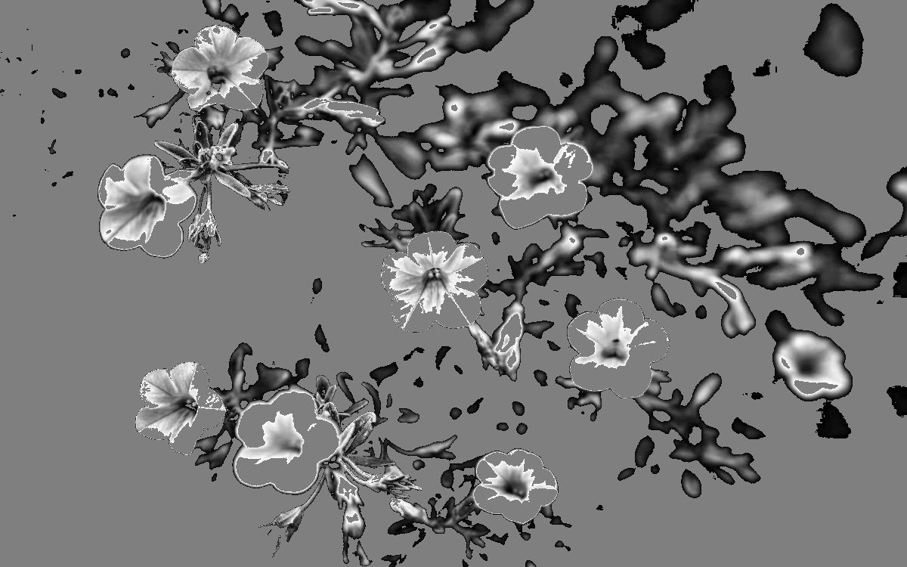
  
  Рисунок 16 &ndash; Контрастирование и серый фон

### 7.4 Нелинейные функции изменения яркости

На примере кусочно-линейных функций мы рассмотрели подход к преобразованию яркости. Данные примеры позволили определить несколько основных моментов для понимания. Чем круче линия в определенной точке, тем выше будет локальный контраст (разница яркости/детальность восприятия) - с математической точки зрения речь идет о значении производной. Обратное тоже верно, чем ниже величина производной функции преобразования якости в определенной точке (более пологая линия), тем меньше будут различаться объекты, близкие по яркости к этой определенной точке. Соответственно при нулевой производной мы теряем все различия и происходит безусловная потеря информации, независимо от того, как мы храним наши данные. Объединив несколько различных значений в одно, мы не сможем провести обратную операцию, задача будет математически некорректной.

Те же моменты действуют и в случае, если мы от кусочно линейных преобразований перейдем к преобразованиям, заданным некоторой нелинейной функцией. С одним примером таких преобразований мы уже знакомы - это гамма преобразования. Пример гамма преобразования приведен на рисунке 17, результат на рисунке 18.

  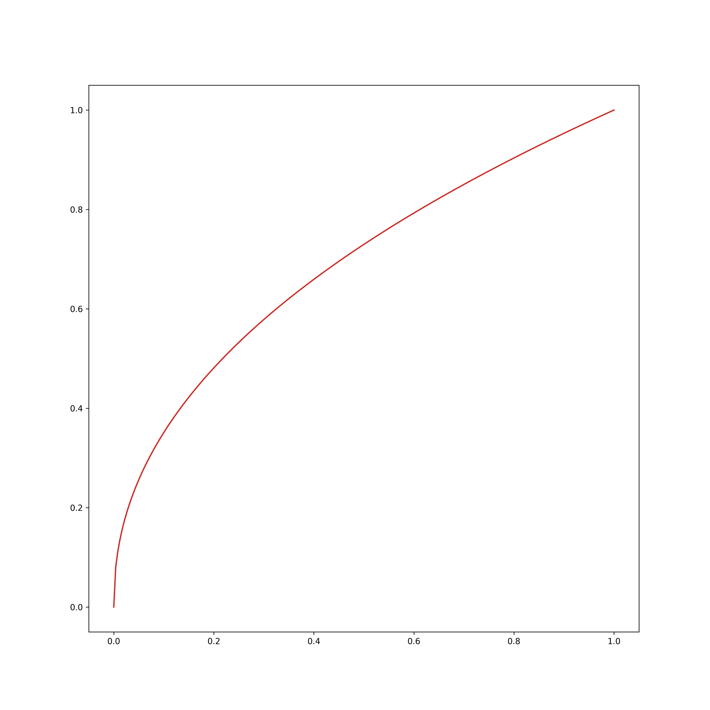
  
  Рисунок 17 &ndash; Гамма-преобразование

  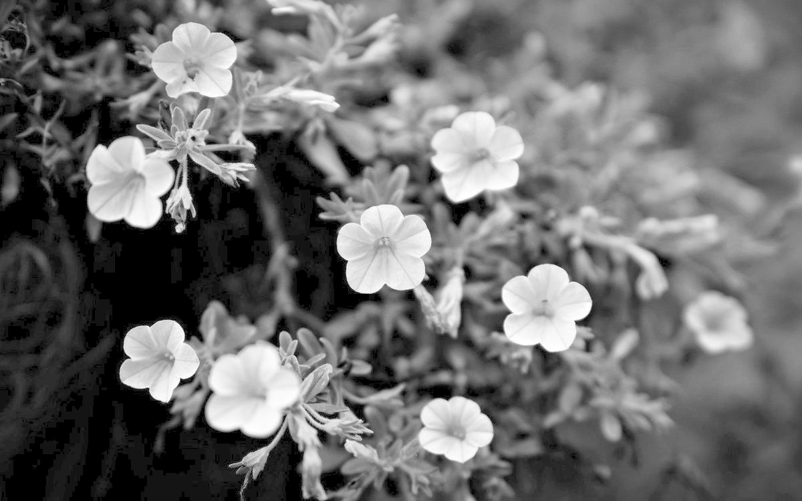
  
  Рисунок 18 &ndash; Результат гамма-преобразования

Обратите внимание, как много деталей было скрыто в тенях изображения. Преобразование имеет в области, близкой к 0 максимальное значение производной. При этом мы не меняли битность изображения, а информативность этой области яркости была повышена за счет понижения информативности в области, близкой к 1. Обратное гамма-преобразование представляет собой обратную функцию к использованной.

### 7.5 Поканальное изменение яркости

При помощи криволинейных преобразований можно выполнять большой спектр операций по обработке изображений. Все приведенные выше примеры демонстрировали работу с каналом яркости, но те же операции можно осуществлять и поканально. При этом для $RGB$ если преобразования для каждого канала одинаковые (как это было сделано со всеми примерами выше), то результат будет идентичен преобразованию яркости. На рисунке 19 приведен пример гамма-преобразования, примененного только к каналу красного цвета.

  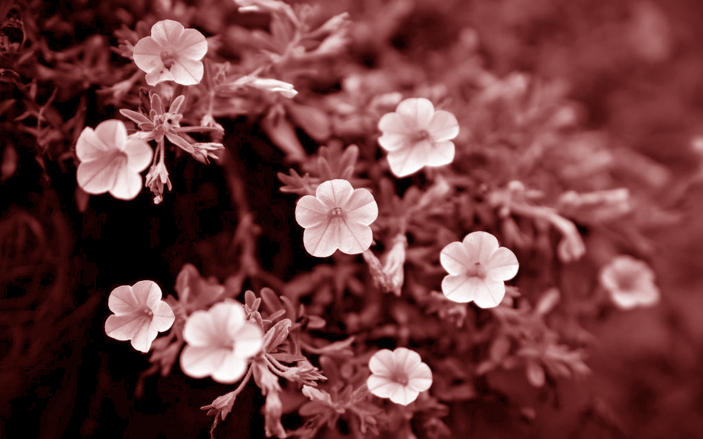
  
  Рисунок 19 &ndash; Результат применения гамма-преобразования к красному каналу

На рисунке 20 представлены отдельно каналы изображения 19.

  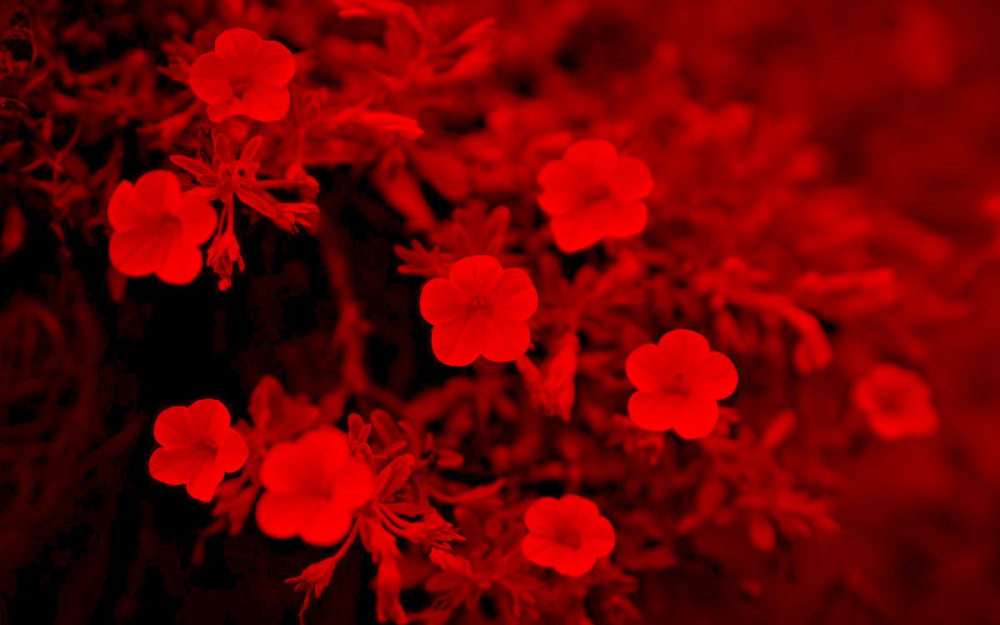
  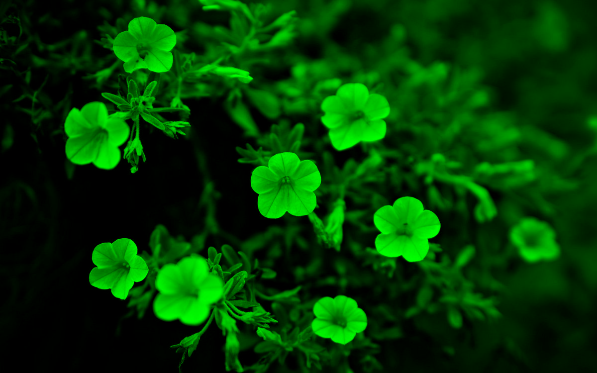
  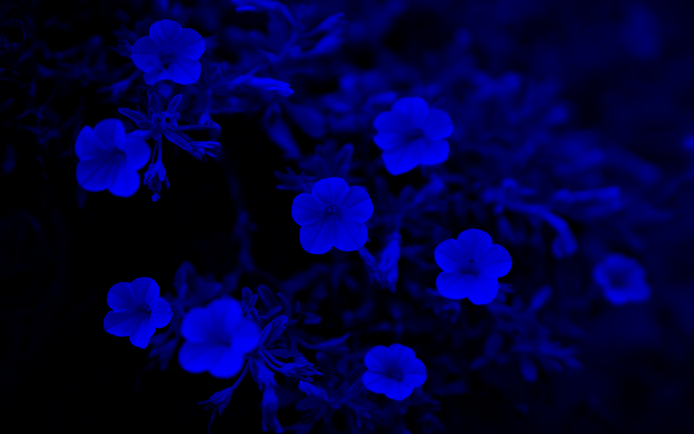
  
  Рисунок 19 &ndash; Поканальный результат применения гамма-преобразования к красному каналу

Обратите внимание на большее количество видимых деталей именно в красном канале.

Так же поканально можно применять кусочно-линейные преобразования. Эти операции можно использовать и для других пространств. Естественно, нужно всегда учитывать свойсват каналов и их структуру, применение преобразований для оттенка $H$ в пространстве $HSV$ приведет к другим результатам из-за отличной от $RGB$ модели.

### 7.6 Идентификация параметров функции преобразования

Преобразования яркости, сначала аналоговые, применялись для цветовой коррекции изображений. Изменения оттенков для исправления различных ошибок при фотографировании или для коррекции химических особенностей используемой пленки/фотобумаги осуществлялись с использованием цветовых фильтров (цветных стекол) на этапе печати фотографий или при полноцветной печати на бумаге. Эти операции проводились оператором на основе его личных знаний и опыта. С появлением цифровой фотографии появилась возможность максимально точной работы с цветом. Цифровую цветокоррекцию может проводить даже человек с нарушениями цветовосприятия вплоть до дальтонизма, что описал один из самых знаменитых цветокорректоров Дэн Маргулис.

Для того чтобы сложилось понимание как осуществлять цифровую цветовую коррекцию, нужно рассмотреть сами преобразования как математические функции. У нас есть изображение с неудовлетворительными цветами, возможно всего изображения, возможно только некоторых важных объектов. Если у нас есть информация о том, какими цветами должны обладать объекты на изображении, то задача цветокоррекции сводится к построению таких преобразований, которые бы перевели старые неверные цвета в новые желаемые.

Весь процесс можно описать таким, максимально общим алгоритмом:
1. Определить области интереса (объекты которые нас не устраивают по цвету)
2. Получить значения исходных цветов в областях интереса (можно брать какие-то конкретные точки объектов, усреднять по цвет небольшие области)
3. Определить желаемые или целевые значения цвета для областей интереса (использовать свое представление и опыт, взять значения с других изображений)
4. Определить модель и параметрический класс функций преобразования (будет ли это поканальное преобразование, линейное, кусочно-определенное, квадратичная функция, гамма-преобразование и т.д.)
5. Решить задачу идентификации параметров функции из определенного выше класса (существует множество математических методов, определяющих функцию, минимально отклоняющуюся от точек, которые определены исходными и целевыми значениями цветов)
6. Применить построенную функцию преобразования ко всему исходному изображению

Мы специально не будем перегружать общий подход строгими математическими формулировками, так как существует множество различных способов реализовать каждый пункт алгоритма. Практическая реализация будет ограничена только вашими навыками и знаниями. Общий подход на основе преобразования яркости тем не менее остается общим. Помимо описанного подхода существуют и другие, например работа с матрицами цветового преобразования, которые мы упоминали в предыдущих лекциях.
